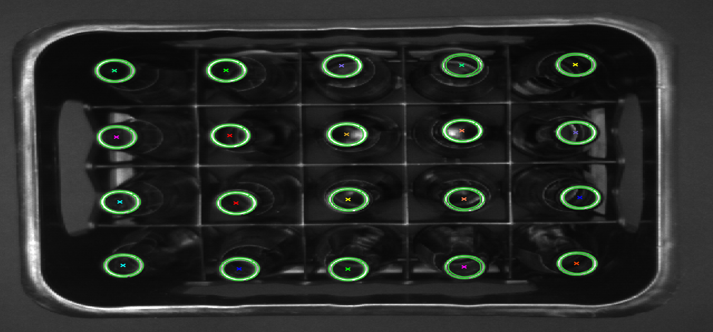

# HACLON中级教程

## 1. 基于形状匹配(Shape-Based)

定位对象内部的灰度值可以有变化，但对象边缘轮廓必须清晰平滑的场合

### 1.1 一般流程

* 图像预处理, 创建ROI图像
* 创建模板, 参数选择

    > 1. create_shape_model(Template,NumLevels, AngleStart, AngleExten,AngleStep, Optimization, Metric, Contrast, MinContrast ,ModelID)
    > 2. 字段说明:   
     >>NumLevels:生成模板的金字塔最大等级,数值越大,清晰度越低.
     >>Optimization: 对于大模型,设小改值可以控制生成模型点的数量,二对于小模型影响不大.
     >>Metric: 分为极性模式,非极性模式等. 极性模式(use_polarity)下匹配物需要与模板背景对比度完全相同,而非极性模式(ignore_global_polarity)则,相反对比度也可以匹配.
     >>Contrast:  模型点必须具有的对比度。对比度是衡量对象和背景之间以及对象不同部分之间的局部灰度值差异.
    >> MinContrast: 模型的最小对比度

* 查找模板

    >1. find_shape_model(Image : : ModelID, AngleStart, AngleExtent, MinScore, NumMatches, MaxOverlap, SubPixel, NumLevels, Greediness : Row, Column, Angle, Score)

   > 2. 字段说明: 
   >> MinScore: 决定了一个潜在的匹配对象至少要有多少分才能被视为图像中的模型实例。MinScore 选得越大，搜索速度越快.
   >> NumMatches: 要找到的实例的最大数量.
   >> MaxOverlap: 决定了两个实例最多可以重叠多少比例（即 0 和 1 之间的数字），以便将它们视为不同的实例，从而分别返回。如果两个实例的重叠度超过MaxOverlap，则只返回最佳实例.
   >> SubPixel: 决定了是否应该以子像素精度提取实例
   >> Greediness: 决定了搜索的"贪婪"程度, 如果贪婪度=1，则可以达到最大的搜索速度。在几乎所有的情况下，贪婪度=0.9时，形状模型总是会被找到

*  返回位置、角度、缩放比、分值
*  清除模板

### 1.2 实践

### 1.3 测试窗口随物体移动与旋转

#### 1.3.1 一般流程

* 加载图像
* 创建形状模板
* 创建ROI测试窗口, 再根据模板坐标创建新的ROI测试窗口
* 依次读取图片
* 在图像中搜索创建的形状模板
* 创建二维齐次变换矩阵(hom_mat2d_identity)
* 根据找到的模板坐标, 为矩阵添加坐标偏移量(hom_mat2d_translate)
* 根据模板的角度, 为上一步的结果再添加角度的偏移量(hom_mat2d_translate)
* 先将输入的ROI偏移坐标转换成HALCON的标准坐标, 再将之前的矩阵绕该点进行转换(affine_trans_pixel)
* 显示图像

### 1.4 卡尺测量

#### 1.4.1 一般流程

* 加载图像
* 创建测试窗口, 坐标等数据用作生成测量模型
* 创建形状模板, 获取坐标角度用作参照物已生成测量模型
* 创建测量模型 

    > 1. create_metrology_model 创建测量模型
    > 2. set_metrology_model_image_size 设置测量对象的图像大小
    > 3. get_metrology_object_model_contour 获取测量模型里的模型轮廓
    > 4. get_metrology_object_measures 获取测量模型里的测量区域

* 加载图像
* 查找形状模板
* 根据形状模板坐标与角度对齐测量模型(align_metrology_model)
* 将测量模型中的计量对象的测量区域内的边缘定位, 并拟合到产生的边缘位置(apply_metrology_model)
* 获取测量结果的各个坐标(get_metrology_object_result)

## 二. 基于支持向量机(SVM)的产品分类

### 2. 相关算子

#### 2.1 创建向量机(create_class_svm)

> create_class_svm( : : NumFeatures, KernelType, KernelParam, Nu, NumClasses, Mode, Preprocessing, NumComponents : SVMHandle)
>> - KernelType: 内核类型, 线性, 齐次/非齐次多项式, 高斯核. RBF核为大多数分类问题提供了一个很好的选择，因此几乎在所有情况下都应该使用.
>> - KernelParam: 核函数的附加参数, 对于高斯核(rbf)是lambda的值, 对于多项式则多项式核的度数. 太高的多项式核度(d>10)可能会导致数值问题。
>> - Nu: 正则化参数Nu是训练错误数量的渐进上界和支持向量数量的渐进下界. 为经验法则，参数Nu应该设置为应用特定误差比的事先期望值，例如0.01（对应最大训练误差为1%）。请注意，Nu的值过大可能会导致不可行的训练问题，即无法正确训练SVM.
>> - NumClasses: 分类的数量.
>> - Mode: SVM的模式. 主要分为one-versus-one, one-versus-all, novelty-detection. 对于少数类（大约10个），"one-vers-one"的训练和测试速度更快. 在多类的情况下，"one-vers-one"更可取，因为 "one-vers-one"会产生大量的子分类器，因为子分类器的数量会随着类数的增加而呈二次方增长。一个特殊的分类情况是Mode = 'novelty-detection'，其中测试数据仅根据训练数据的成员资格进行分类，即NumClasses必须设置为1。

>> - Preprocessing与NumComponents: Preprocessing ='normalization'与Preprocessing = 'none'，NumComponents会被忽略。对于Preprocessing = 'principal_components'，要进行主成分分析（PCA）; Preprocessing = 'canonical_variates'指定的变换首先对训练向量进行归一化，然后对所有类的训练向量进行平均装饰。

## 三. 物体周边毛刺检测

### 3.1 流程

* 加载图像
* 使用binary_threshold分割图像并返回明亮的图像区域
* 对上步返回的区域执行底帽变换, 获取毛刺部分

  > 1. closing_circle     (闭运算)
  > 2. difference        (闭运算后的图像-原图像)

* 对毛刺部分执行开运算

  > opening_rectangle1

### 3.2 相关概念

* 底帽变换: 闭运算后的图像-原图像. B(f)=(f*b)-f . 底帽变换一般用于删除明亮背景中的暗目标. 

## 四.  极坐标变换检测圆形物体

  ### 4.1 流程

* 加载图像
* 自动阈值 auto_threshold(Image : Regions : Sigma : )
* 对区域一进行开运算
* 对开运算区域进行闭运算
* 填充闭运算后区域  
* 获取区域外边界
* 对区域边界进行膨胀运算
* 运用CANNY算法进行边缘探测
* 对边缘轮廓分割成直线和圆
* 将共圆上的轮廓连接起来
* 获取轮廓长度的最大值
* 对最大的轮廓进行拟合圆操作
* 对拟合圆进行膨胀运算
* 对拟合圆进行腐蚀运算
* 求两区域补集
* 将图像从笛卡尔直角坐标系转换到极坐标系
* 对灰度拉伸的图像进行均值滤波
* 局部阈值处理
* 连通处理
* 根据高度过滤区域
*  用矩形结构元素进行闭运算
*  将区域连接起来
*  将区域从极坐标转换到直角坐标系中
*  *旋转图像

  

## 五. 基于分水岭的目标分割

### 5.1 流程

* 加载图像
* 阈值分割图像

  > threshold

* 连通图像

  > connection

* 对连通后的区域进行按面积过滤

* 预处理图像, 距离变换

  > distance_transform

* 图像反转

  >1. convert_image_type
  >2. invert_image
  >3. scale_image_max

* 分水岭算法进行图像分割

    > watersheds_threshold

* 对分水岭算法处理后的图像与连通处理后的图像取交集, 获得最终的结果

  >intersection

  ### 5.2 相关概念

  + 分水岭算法: 直接使用算法分割可能会因为噪声或是梯度导致过度分割. 为避免过度分割, 一般需要通过标记预处理图像, 标记的选择可以是相对距离, 形状等. 当前使用的是距离变换算法进行预处理. 通过标记, 可以区分前景与背景, 以避免过度分割.

##  六. 单目面阵摄像机标定与测量

### 6.1 流程

* 1. 创建标定数据模型

  > create_calib_data ('calibration_object', 1, 1, CalibDataID)F

* 2. 设置相机类型并初始化标定数据模型里的摄像机内部参数

    > set_calib_data_cam_param (CalibDataID, 0, 'area_scan_division', StartCamPar)

* 3. 为校正模型指定校正文件

  > set_calib_data_calib_object (CalibDataID, 0, CaltabName)

* 4. 获取校正板内边框以内的区域

  > find_caltab (Image, Caltab, CaltabName, 3, 112, 5)

* 5. 提取出图像中MARK点的位置并计算出摄像机外部参数

  > find_marks_and_pose (Image, Caltab, CaltabName, StartCamPar, 128, 10, 18, 0.9, 15, 100, RCoord, CCoord, StartPose)

* 6. 收集观察数据

  > set_calib_data_observ_points (CalibDataID, 0, 0, i, RCoord, CCoord, 'all', StartPose)

* 7. 校正摄像机

  > calibrate_cameras (CalibDataID, Error)

* 8. 获取优化以后的摄像机内部参数

  > get_calib_data (CalibDataID, 'camera', 0, 'params', CamParam)

* 9. 获取优化以后的校正对象姿势，相对于当前参考相机。

  > get_calib_data (CalibDataID, 'calib_obj_pose', [0, 1], 'pose', PoseCalib)

* 10. 将校正对象姿势顺时针旋转90度

 > insert (PoseCalib, PoseCalib[5] -90, 5, PoseCalibRot)

* 11. 将摄像机位姿进行X, Y, Z的平移(矩阵乘积)

> set_origin_pose (PoseCalibRot, -0.04, -0.03, 0.00075, Pose)

* 12. 根据摄像机内参和外参生成一个投影变换，这个投影变换代表图像坐标系(z=0)到世界坐标系的转换关系

> gen_image_to_world_plane_map (Map, CamParam, Pose, Width, Height, Width, Height, PixelDist, 'bilinear')

* 13. 将投影变换应用到当前图像上

> map_image (Image, Map, ModelImageMapped)
