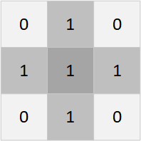
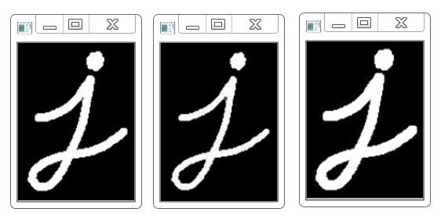
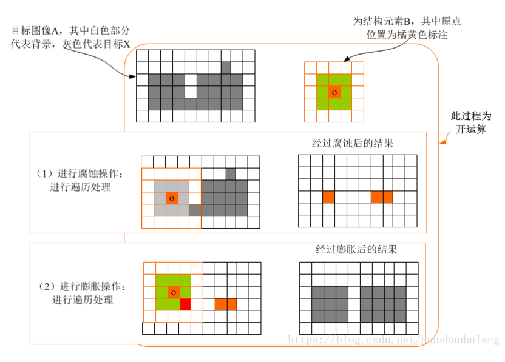
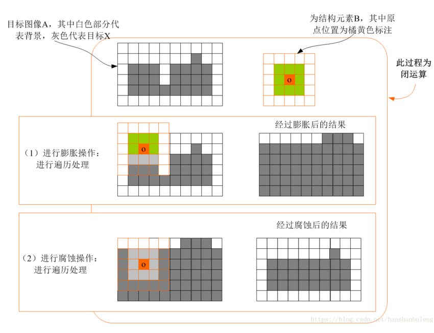
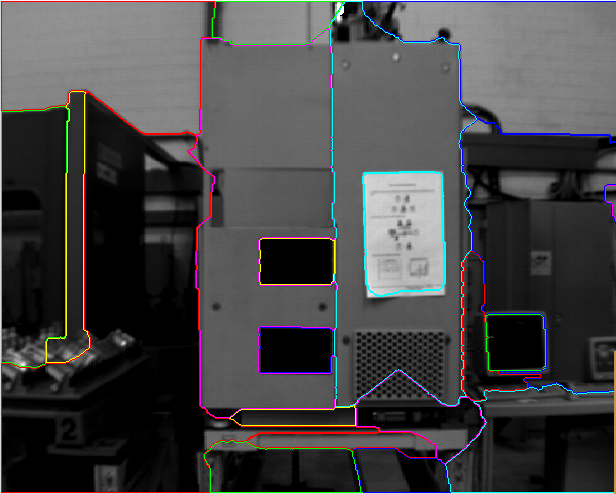

# HACLON初级教程

## 1. 基本概念

### 1.1 图像ROI

* ROI（Region of Interest）表示感兴趣区域。感兴趣区域，就是我们从图像中选择一个图像区域，这个区域就是图像分析所关注的焦点。我们圈定这个区域，那么我们要处理的图像就是要从一个大图像变为小图像区域了，这样以便进行进一步处理，可以大大减少处理时间。
* gen_rectangle1, gen_rectangle2, get_circle等

### 1.2 图像通道

* HSL（HSV、HSB）色彩空间，是将颜色分出「色相」「饱和度」和「亮度（明度）」三个分量
* RGB 色彩空间，是将颜色分出「红色」「绿色」「蓝色」三个分量
* 颜色某个分量，就是通道
* decompose3, trans_from_rgb, trans_to_rgb, compose3

### 1.3 图像灰度化

* 图像灰度化是将一幅彩色图像转换为灰度化图像的过程。彩色图像通常包括R、G、B三个分量，分别显示出红绿蓝等各种颜色，灰度化就是使彩色图像的R、G、B三个分量相等的过程.

### 1.4 图像二值化

* 二值化核心思想，设阈值，大于阈值的为0（黑色）或 255（白色），使图像c成为黑白图。。

## 2. 图像形态学

* 在特殊领域运算形式——结构元素（Structure Element），在每个像素位置上与二值图像对应的区域进行特定的逻辑运算。运算结构是输出图像的相应像素。运算效果取决于结构元素大小内容以及逻辑运算性质。

### 2.1 结构元素

* 膨胀和腐蚀操作的最基本组成部分，用于测试输出图像，通常要比待处理的图像小很多，二维平面结构元素由一个数值为0或1的矩阵组成。结构元素的原点指定了图像中需要处理的像素范围，结构元素中数值为1的点决定结构元素的领域像素进行膨胀或腐蚀操作时是否需要参与计算。

### 2.2 腐蚀和膨胀

* 图像的膨胀（Dilation）和腐蚀（Erosion）是两种基本的形态学运算，主要用来寻找图像中的极大区域和极小区域。其中膨胀类似于“领域扩张”，将图像中的高亮区域或白色部分进行扩张，其运行结果图比原图的高亮区域更大；腐蚀类似于“领域被蚕食”，将图像中的高亮区域或白色部分进行缩减细化，其运行结果图比原图的高亮区域更小。

* 膨胀: dilation_rectangle1, dilation_circle等
* 腐蚀: erosion_rectangle1, erosion_circle等

  

### 2.3 开闭运算

* 开运算: 先腐蚀后膨胀, 开运算能够除去孤立的小点，毛刺和小桥，而总的位置和形状不变。
* opening_circle, opening_rectangle1等

* 闭运算: 先膨胀运算，再腐蚀运算, 闭运算能够填平小湖（即小孔），弥合小裂缝，而总的位置和形状不变.
* closing_circle, closing_rectangle1等

* 注意: 开闭运算无法还原图像

## 3. 图像的分割方法

### 3.1 基于阈值的分割方法

* 阈值法的基本思想是基于图像的灰度特征来计算一个或多个灰度阈值，并将图像中每个像素的灰度值与阈值作比较，最后将像素根据比较结果分到合适的类别中。因此，该方法最为关键的一步就是按照某个准则函数来求解最佳灰度阈值。
* 阈值法特别适用于目标和背景占据不同灰度级范围的图。

* 特点: 只考虑像素点灰度值本身的特征，一般不考虑空间特征，因此对噪声比较敏感，鲁棒性不高。

* threshold, binary_threshold, dyn_threshold

### 3.2 区域生长

* 区域生长是从一组代表不同生长区域的种子像素开始，接下来将种子像素邻域里符合条件的像素合并到种子像素所代表的生长区域中，并将新添加的像素作为新的种子像素继续合并过程，知道找不到符合条件的新像素为止
*  特点: 对某些复杂物体定义的复杂场景的分割或者对某些自然景物的分割等类似先验知识不足的图像分割效果较为理想。
* regiongrowing, expand_region

### 3.3 分水岭算法

* 其基本思想是把图像看作是测地学上的拓扑地貌，图像中每一点像素的灰度值表示该点的海拔高度，每一个局部极小值及其影响区域称为集水盆，而集水盆的边界则形成分水岭。分水岭的概念和形成可以通过模拟浸入过程来说明。在每一个局部极小值表面，刺穿一个小孔，然后把整个模型慢慢浸入水中，随着浸入的加深，每一个局部极小值的影响域慢慢向外扩展，在两个集水盆汇合处构筑大坝，即形成分水岭。
* 特点: 分水岭对微弱边缘具有良好的响应，图像中的噪声、物体表面细微的灰度变化都有可能产生过度分割的现象，但是这也同时能够保证得到封闭连续边缘
