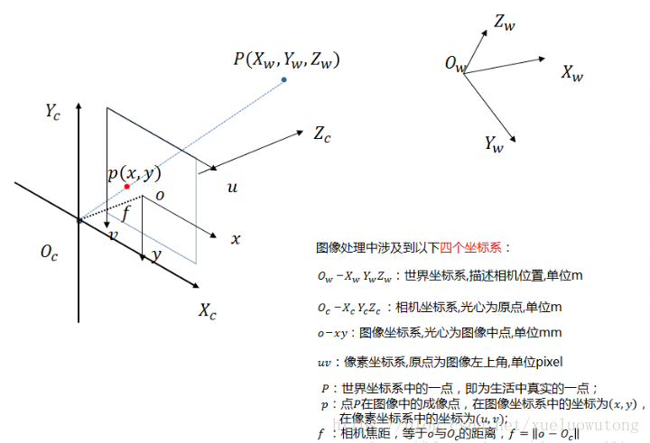

# HALCON手眼标定

## 3. 手眼标定

### 3.1 简介

> 为了使得相机（亦即机器人的眼）与机器人（亦即机器人的手）坐标系之间建立关系就必须要对机器人与相机坐标系进行标定，该标定过程也就叫做手眼标定

> 机器人和摄像机的手眼标定问题分为两类构型:  

* eye-to-hand，摄像机固定，与机器人基坐标系相对位置不变, 即标定得到机器人末端与相机之间的坐标变换关系.
* eye-in-hand，摄像机安装在机器人末端，随着机器人一起移动, 机器人手眼标定即标定得到机器人基座与相机之间的坐标变换关系.

### 3.2 Eye-To-Hand(相机固定)

#### 3.2.1 公式

$$ ^{com}H_{cal} (1) =^{com}H_{base} (2)* ^{base}H_{tool} (3)* ^{tool}H_{cal}(4)$$

* 上式中H表示齐次变换矩阵
* 上式中已知量为

  >(1). 摄像机坐标系下校正对象的位姿
  >(3). 机器人坐标系下机器人工具的位姿

* 其余为未知量即: 

  > (2). 工业摄像机坐标系下为机器人坐标系的位姿
  > (4). 机器人工具坐标系下校正对象坐标系的位姿

* 无夹具发送给机械手的位姿

  $$ ^{base}H_{tool} (grip.pos) =^{base}H_{obj}$$

* 有夹具发送给机械手的位姿

  $$ ^{base}H_{tool} (grip.pos) =^{base}H_{obj}*(^{tool}H_{gripper})^{-1}$$

### 3.3 Eye-In-Hand(相机移动)

#### 3.3.1 公式

$$ ^{com}H_{cal} (1) =^{com}H_{tool} (2)* ^{tool}H_{base} (3)* ^{base}H_{cal}(4)$$

* 上式中H表示齐次变换矩阵
* 上式中已知量为

  >(1). 摄像机坐标系下校正对象的位姿
  >(3). 工具坐标系下机器人的位姿

* 其余为未知量即: 

  > (2). 工业摄像机坐标系下机器人工具坐标系的位姿
  > (4). 机器人坐标系下校正对象坐标系的位姿

### 3.4 摄像机内/外部参数

#### 3.4.1 相机坐标系

#### 3.4.2 相机内部参数

> 1. division模式

* Focus（焦距）: 远焦镜头镜头焦距的长度
* Kappa: 扭曲系数
* Sx，Sy：像素大小
* Cx，Cy：图像中心点坐标
* Whith，Height：图像的宽高

> 2. polynomia模式

* Focus（焦距）: 远焦镜头镜头焦距的长度
* K1, K2, K3, P1, P2: 扭曲系数
* Sx，Sy：像素大小
* Cx，Cy：图像中心点坐标
* Whith，Height：图像的宽高

#### 3.4.2 相机外部参数

* 世界坐标系下摄像机的位姿(Tx, Ty, Tz, ω, δ, θ)

### 3.5 位姿

#### 3.5.1 类型

* 1. abg类型

$$ R_{abg} =R_{z} (RotZ)* R_{y} (RotY)*R_{x}(RotX)$$

* 2. gba类型

$$ R_{gba} =R_{x} (RotX)* R_{y} (RotY)*R_{z}(RotZ)$$

* 3. zyz类型

$$ R_{zyz} =R_{z} (Rl)* R_{y} (Rm)*R_{z}(Rr)$$

#### 3.5.2 位姿的创建

1. 位姿类型为abg或gba

   > 直接使用create_pose( : : TransX, TransY, TransZ, RotX, RotY, RotZ, OrderOfTransform, OrderOfRotation, ViewOfTransform : Pose)创建

2. 位姿类型为zyz

   >需要使用齐次变换矩阵转换为对应位姿

    > - 生成相同三维齐次变换矩阵。 
    > -  hom_mat3d_identity (HomMat3DIdentity)
    > - 为三维齐次矩阵添加偏移量T。
    > - hom_mat3d_translate (HomMat3DIdentity, Tx, Ty, Tz, HomMat3DTranslate)
    > - 依次为三维齐次矩阵添加zyz方向的旋转
    > - hom_mat3d_rotate_local (HomMat3DTranslate, rad(Rl), 'z', HomMat3DT_Rl)
    > - hom_mat3d_rotate_local (HomMat3DT_Rl, rad(Rm), 'y', HomMat3DT_Rl_Rm)
    > - hom_mat3d_rotate_local (HomMat3DT_Rl_Rm, rad(Rr), 'z', HomMat3D)
    > - 将一个三维齐次变换矩阵转换为对应的 3D 位姿
    > - hom_mat3d_to_pose (HomMat3D, Pose)

## 4. 六轴关节机器人手眼标定

### 4.1 一般流程

<!--  准备手眼标定的数据 -->

* 读取摄像机内部参数

  > read_cam_par (DataNameStart + 'start_campar.dat', StartCamParam)
  

* 创建手眼标定模型

  > create_calib_data ('hand_eye_stationary_cam', 1, 1, CalibDataID)

* 设置摄像机内部参数

  > set_calib_data_cam_param (CalibDataID, 0, 'area_scan_division', StartCamParam)

* 设置标定板描述文件

  > set_calib_data_calib_object (CalibDataID, 0, CalTabFile)

* 采用非线性算法获取精确校准姿态

  > set_calib_data (CalibDataID, 'model', 'general', 'optimization_method', 'nonlinear')

* 设置标定板描述文件

  > set_calib_data_calib_object (CalibDataID, 0, CalTabFile)

<!-- 获取标定板MARK点坐标和标定板相对相机的位姿 -->

* 寻找标定板对象

  > find_calib_object (Image, CalibDataID, 0, 0, I, [], [])

* 获取标定板轮廓

  > get_calib_data_observ_contours (Caltab, CalibDataID, 'caltab', 0, 0, I)

* 获取标定板MARK点坐标和标定板相对相机的位姿

  > get_calib_data_observ_points (CalibDataID, 0, 0, I, RCoord, CCoord, Index, CalObjInCamPose)

* 读取机器人基座坐标系下机器人工具位姿

  > read_pose (DataNameStart + 'robot_pose_' + I$'02d' + '.dat', ToolInBasePose)

* 设置机器人基座坐标系下机器人工具位姿设置到手眼标定模型里

  >set_calib_data (CalibDataID, 'tool', I, 'tool_in_base_pose', ToolInBasePose)
<!-- 执行手眼标定 -->

* 执行手眼标定

  >calibrate_hand_eye (CalibDataID, Errors)

* 查询手眼标定的错误情况

  > get_calib_data (CalibDataID, 'model', 'general', 'camera_calib_error', CamCalibError)

* 获取校正后摄像机内部参数

  > get_calib_data (CalibDataID, 'camera', 0, 'params', CamParam)

* 获取摄像机坐标系下机器人基座的位姿

  > get_calib_data (CalibDataID, 'camera', 0, 'base_in_cam_pose', BaseInCamPose)

* 获取机器人工具坐标系下校正对象的位姿

  > get_calib_data (CalibDataID, 'calib_obj', 0, 'obj_in_tool_pose', ObjInToolPose)
<!-- 保存手眼标定的结果到本地硬盘 -->

* 保存相机内部参数参数到本地文件

  > write_cam_par (CamParam, DataNameStart + 'final_campar.dat')

* 将摄像机坐标系下的机器人底座位姿保存到本地

  > write_pose (BaseInCamPose, DataNameStart + 'final_pose_cam_base.dat')   

* 将机器人工具坐标系下的校正对象的位姿保存到本地

  > write_pose (ObjInToolPose, DataNameStart + 'final_pose_tool_calplate.dat')
<!-- 计算摄像机坐标系下校正对象的位姿 -->

* 获取机器人基准坐标中机器人工具的姿态

  >get_calib_data (CalibDataID, 'tool', PoseIds[I], 'tool_in_base_pose', ToolInBasePose)

* 计算摄像机坐标系下校正对象的位姿

  > calc_calplate_pose_stationarycam (ObjInToolPose, BaseInCamPose, ToolInBasePose, CalObjInCamPose)
<!-- 获取机器人基座坐标系中校正对象的位姿 -->

* 获取机器人基座坐标系下摄像机的位姿

  > pose_invert (BaseInCamPose, CamInBasePose)

* 获取机器人基座坐标系中校正对象的位姿

  > pose_compose (CamInBasePose, ObjInCamPose, ObjInBasePose)

## 5.  六轴关节机器人手眼标定之目标抓取

### 5.1 Eye-To-Hand(相机固定)

  $$ ^{base}H_{obj} =^{base}H_{cam}*^{cam}H_{obj}$$

### 5.2 Eye-To-Hand(相机固定)

  $$ ^{base}H_{obj} =^{base}H_{cam}(acq*pos.)*^{tool}H_{cam}*^{cam}H_{obj} $$

### 5.3 本例思路

  $$ ^{base}H_{tool} =^{base}H_{cam}*^{cam}H_{ref}*^{ref}H_{grasp}*^{gripper}H_{tool}$$

## 6.  六轴关节机器人手眼标定之目标抓取

### 6.1 简介

* Scara机械手包括3个平移+1个旋转，共计4个自由维度，动作会受到限制，它不能倾斜，但它能提供更快，更精确的性能
* SCARA机器人必须提前对摄像机进行校准, 然后再对手眼系统进行校正.
* 需要为SCARA机器人确定Z轴方向的平移. 在校准SCARA机器人时，无法明确地确定所有位姿，当相机固定/移动拍照的时候, 无法确定机器人基础坐标系下的校正对象的位姿中的Z偏移量，当我们手眼标定结束后，需要确定这个Z偏移量，将手眼标定的结果平移Z单位；

### 6.2 如何确定Z轴偏移量

* 相机固定时:

  > 1. 通过校准板获取摄像机坐标系下校准板的位姿.(1)
  > 2. 将机器人的工具手动移动到校准板的原点，然后查询机器人工具位姿(2).
  > 3. 通过手眼标定结果获取的摄像机坐标系下的机器人位姿.(3)
  > 4. 通过以上三个位姿计算出Z轴偏移量
   $$^{base}H_{obj}=(^{cam}H_{base}(3))^{-1}*^{cam}H_{obj}(1)$$
   $$ z= ^{base}H_{obj}[2] -^{base}H_{tool}(2)[2]$$ 
  <!-- 2式指的是对应位姿中的z分量 -->

* 相机移动时:

  > 1. 通过校准板获取摄像机坐标系下校准板的位姿. (1)
  > 2. 通过机器人软件获取机器人坐标系下机器人工具的位姿. (2)
  > 3. 将机器人的工具手动移动到校准板的原点, 通过机器人软件获取机器人坐标系下机器人工具的位姿. (3)
  > 4. 通过手眼标定结果获取的摄像机坐标系下的机器人工具位姿. (4)
  > 5. 通过以上位姿计算出Z轴偏移量

   $$^{tool1}H_{obj}=(^{cam}H_{tool1}(4)*^{cam}H_{obj}(1)$$
   $$^{tool1}H_{tool2}=(^{base}H_{tool2}(3))^{-1}*^{base}H_{tool1}(2)$$
   $$ z= ^{tool1}H_{obj}[2] -^{tool1}H_{tool2}[2]$$ 

  > * 求出偏移量后, 需要利用偏移量转换摄像机坐标系下的机器人坐标的位姿
  > * set_origin_pose (BaseInCamPosePre, 0, 0, ZCorrection, BaseInCamPose)
