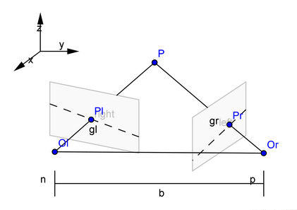

# HACLON高教程

## 双目标定

### 1. 相关概念

* 左相机坐标: Xl=f*X/Z Yl=f*Y/Z
* 左相机坐标: Xr=f*(X-Tx)/Z Yr=f*Y/Z
* 视差: d=Xl-Xr=f*(Tx/Z)
* 基线: 左右两相机光心连线.
* 极平面: 两相机光心决定的平面.
* 极点: 基线与两摄像图像平面交点.
* 极线: 极平面与图像平面交线.

* 双目摄像机系统主要的任务就是测距，而视差求距离公式是在双目系统处于理想情况下推导的，但是在现实的双目立体视觉系统中，是不存在完全的共面行对准的两个摄像机图像平面的。所以我们要进行立体校正。立体校正的目的就是，把实际中消除畸变后的非共面行对准的两幅图像，校正成共面行对准.
* 理想双目系统：两摄像机图像平面平行，光轴和图像平面垂直，极点处于无穷远处，此时点(x0, y0)对应的级线就是y=y0。

### 2. 一般流程

* 1. 获取左右相机图像中标定板的区域

    > find_caltab(Image : CalPlate : CalPlateDescr, SizeGauss, MarkThresh, MinDiamMarks : )

* 2. 提取左右相机图像中标定板的MARK点坐标和摄像机外部参数

    > find_marks_and_pose(Image, CalPlateRegion : : CalPlateDescr, StartCamParam, StartThresh, DeltaThresh, MinThresh, Alpha, MinContLength, MaxDiamMarks : RCoord, CCoord, StartPose)

* 3. 执行双目标定

    > binocular_calibration( : : NX, NY, NZ, NRow1, NCol1, NRow2, NCol2, StartCamParam1, StartCamParam2, NStartPose1,NStartPose2, EstimateParams : CamParam1, CamParam2, NFinalPose1, NFinalPose2, RelPose, Errors)

* 4. 获取非标准外极线几何到标准外极线几何之间的变换矩阵

    > gen_binocular_rectification_map( : Map1, Map2 : CamParam1, CamParam2, RelPose, SubSampling, Method, MapType :CamParamRect1, CamParamRect2, CamPoseRect1, CamPoseRect2, RelPoseRect)

* 5. 通过变换矩阵对未校正的图像进行图像校正

    > map_image(Image, Map : ImageMapped : : )
