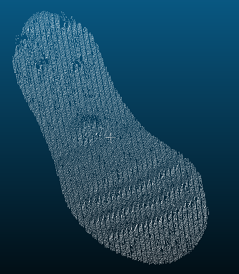
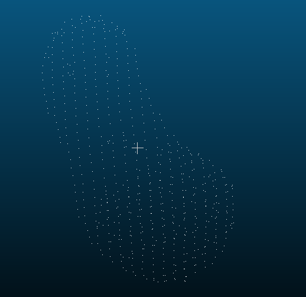
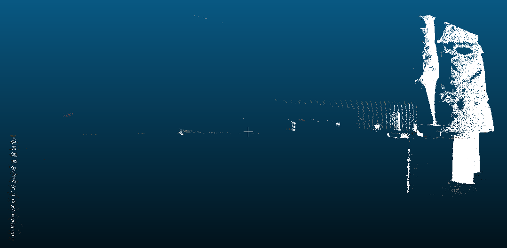
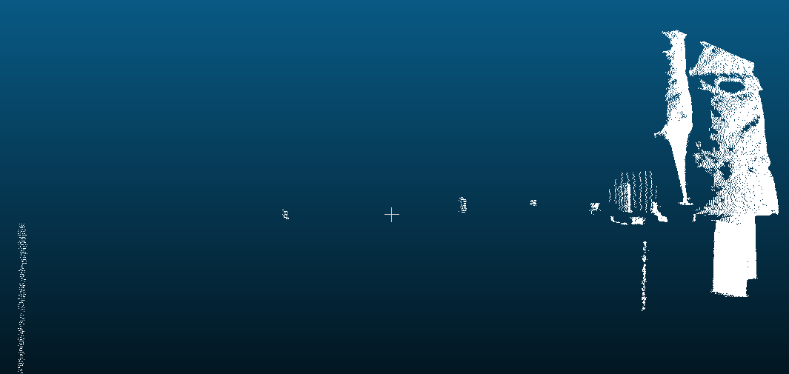
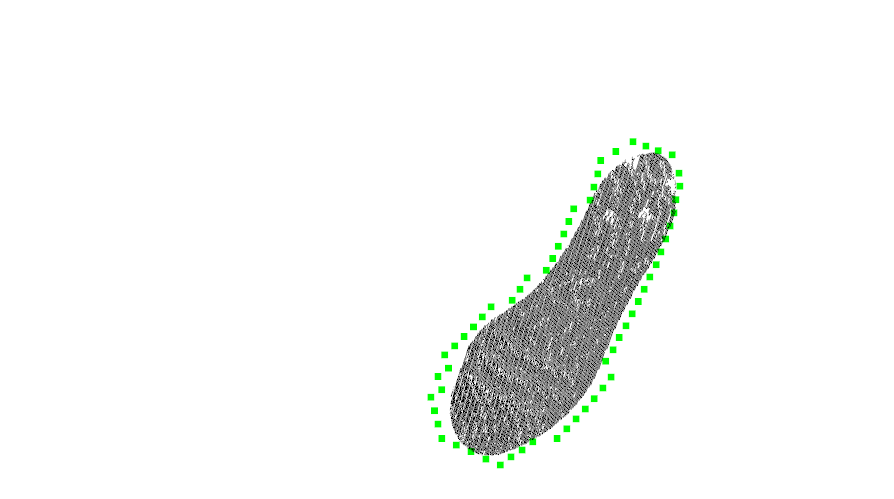
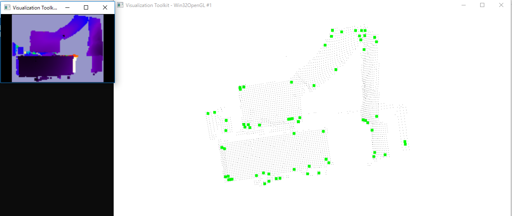
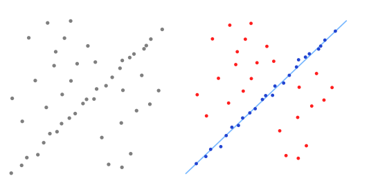

# Point Cloud Library

## 1. 概述

### 1.1 点云(Point Cloud)

* 点云(Point Cloud)是三维空间中，表达目标空间分布和目标表面特性的点的集合，点云通常可以从深度相机中直接获取，也可以从CAD等软件中生成。点云是用于表示多维点集合的数据结构，再表示坐标数据的同时包含了颜色、强度值、时间等属性.
* 典型的PCD文件:

``` 
# .PCD v.5 - Point Cloud Data file format
VERSION .5
FIELDS x y z
SIZE 4 4 4
TYPE F F F
COUNT 1 1 1
WIDTH 397
HEIGHT 1
POINTS 397
DATA ascii
0.0054216 0.11349 0.040749
-0.0017447 0.11425 0.041273
-0.010661 0.11338 0.040916
0.026422 0.11499 0.032623
0.024545 0.12284 0.024255
0.034137 0.11316 0.02507
```

* PCD 不是第一个支持3D点云数据的文件类型，尤其是计算机图形学和计算几何学领域，已经创建了很多格式来描述任意多边形和激光扫描仪获取的点云。常见的有下面几种格式: PLY, STL, OBJ.
* 上述文件选用的是ascii存储点云数据, 通常还会用binary格式存储点云, 相比ascii存储空间更小.

``` 
# .PCD v0.7 - Point Cloud Data file format
VERSION 0.7
FIELDS x y z
SIZE 4 4 4
TYPE F F F
COUNT 1 1 1
WIDTH 5
HEIGHT 1
VIEWPOINT 0 0 0 1 0 0 0
POINTS 5
DATA binary
�x˾�:��ϕ>�];�`�*?���>�<���Z?�*����P���j��(<>�x??
```

### 1.2 点云库Point Cloud Library)

* PCL（Point Cloud Library）是用于2D / 3D图像和点云处理的大型开源跨平台的C++编程库。 PCL框架实现了大量点云相关的通用算法和高效的数据结构。内容涉及了点云的获取、滤波、分割、配准、检索、特征提取、特征估计，表面重建、识别、模型拟合、追踪、曲面重建、可视化等等，这些算法可用于从嘈杂的数据中过滤出异常值，将3D点云缝合在一起，分割场景的部分区域，提取关键点并计算描述符，根据物体的几何外观识别实际物体，创建表面点云并将其可视化。

### 2 点云拓补结构

#### 2.1 点云的特点

* 通过雷达，激光扫描，3D摄像机等三维测量设备获取的点云数据，具有数据量大，分布不均匀等特点，作为三维领域中一个重要的数据来源，点云主要是表征目标表面的海量点的集合，并不具备传统网格数据的几何拓扑信息，所以点云数据处理中最为核心的问题就是建立离散点间的拓扑关系，实现基于邻域关系的快速查找. 常见的空间索引一般是自上而下逐级划分空间的各种索引结构，包括BSP树，k-d tree、KDB tree、R tree、CELL tree、八叉树等。有了这些关系，就可以实现点云的降采样，计算特征向量，点云匹配，点云拆分等功能.

#### 2.2 Kdtree

* k-d树 （k-dimensional树的简称），是一种划分k维数据空间的数据结构，本质也是一颗二叉树，只不过每个节点的数据都是k维，当k=1时，就是的普通二叉树。
* 建立Kdtree实际上是一个不断划分的过程，首先选择最sparse的维度（一般通过计算数据在各个维度的方差，选择方差大的作为本次分割维度），然后找到该维度上的中间点，垂直该维度做第一次划分。此时k维超平面被一分为二，在两个子平面中再找最sparse的维度，以此类推直到最后一个点也被划分，那么就形了一个不断二分的树。
* 搜索一般有：
    - "范围查询" ：给定查询点和查询距离的阈值，从数据集中找出所有与查询点距离小于阈值的数据 
    - "K近邻查询" ：K近邻查询是给定查询点及正整数K，从数据集中找到距离查询点最近的"K"个数据，当K=1，则为[最近邻查询]；

#### 2.3 Octree 
* Octree即为八叉树，它的特性为树中的任一节点的子节点恰好只会有八个或零个。经常应用于3D场景管理，它可以迅速搜索物体在3D场景中的位置，或侦测到与其他物体是否有碰撞以及判断是否在可视范围内。
* pcl的octree库提供了从点云数据创建具有层次的数据结构的方法。这样就可以对点数据集进行空间分区，下采样和搜索操作。每个八叉树节点有八个子节点或没有子节点。根节点描述了一个包围所有点的3维包容盒子。
* pcl_octree实现提供了有效的最近邻居搜索（邻域搜索）API，例如“ 体素(Voxel)邻居搜索”，“ K最近邻居搜索”和“半径搜索邻居”。叶子节点类也提供其他功能，例如空间“占用率”和“每个体素(Voxel)的点密度”检查；序列化和反序列化功能可将八叉树结构有效地编码为二进制格式；此外，内存池实现减少了昂贵的内存分配和释放操作，以便快速创建八叉树

#### 2.4 Kdtree与Octree对比

* 显然，对于不同点云应该采取不同的搜索策略，如果点云是疏散的，分布很广泛，且每什么规律（如lidar测得的点云或双目视觉捕捉的点云）Kdtree能更好的划分，而Octree则很难决定最小立方体应该是多少，太大则一个立方体里可能有很多点云，太小则可能立方体之间连不起来。如果点云分布非常规整，是某个特定物体的点云模型，则应该使用Octree，因为很容易求解凸包并且点与点之间相对距离无需再次比对父节点和子节点，更加明晰，典型的例子是斯坦福的兔子。

## 3. 点云滤波

* 在获取点云数据时，点云数据中不可避免地出现一些噪声点。实际应用中除了测量随机误差产生的噪声点之外，由于受到外界干扰如视线遮挡、障碍物等因素的影响，点云数据中往往存在着一些离主体点云较远的离散点，即离群点。不同的获取设备点云噪声结构也有不同。
* 在点云处理流程中滤波处理作为预处理的第一步，往往对后续处理流程影响很大，只有在滤波预处理中将噪声点、离群点、孔洞、数据压缩等按照后续需求处理，才能够更好地进行配准、特征提取、曲面重建、可视化等后续流程。
* PCL中点云滤波模块提供了很多灵活实用的滤波处理算法，例如双边滤波、高斯滤波、条件滤波、直通滤波、基于随机采样一致性滤波RANSAC等.

### 3.1 直通滤波(PassThrough)
* 指定字段，指定坐标范围进行裁剪。可以选择保留范围内的点或者范围外的点
### 3.2 体素滤波器(VoxelGrid)
* 通过体素网格实现降采样，即减少点的数量，减少点云数据，并同时保持点云的形状特征，在提高配准、曲面重建、形状识别等算法速度中非常实用.


### 3.3 离群点移除过滤器(StatisticalOutlierRemoval)
* 稀疏离群值的消除基于输入数据集中点到邻居距离的分布的计算。对于每个点，我们计算从它到所有相邻点的平均距离。通过假设结果分布是具有均值和标准差的高斯分布，可以将其平均距离在由全局距离均值和标准差定义的区间之外的所有点视为离群值并从数据集中进行修剪。 下图显示了稀疏离群值分析和删除的效果：原始数据集显示在左侧，结果数据集显示在右侧。数据集图显示了滤波前后每个点的邻域中平均K最近邻距离。




<!-- ### 3.4 条件滤波(ConditionalRemoval)
* 条件滤波，设置不同维度滤波规则进行滤波. -->


## 4. 深度图
### 4.1 从深度图到点云
* 深度图像（depth image)也叫距离影像（range image），是指将从图像采集器到场景中各点的距离（深度）值作为像素值的图像.

### 4.2 深度图的边界
* 从深度图像中提取边界,我们对三种不同类型的点感兴趣:
> obstacle border：对象边界（属于对象的最外面的可见点）
> shadow border：阴影边界（在背景中与遮挡物相邻的点）
> Veil points：面纱点集（对象边界边界与阴影边界之间的内插点）
* 边界:从前景跨越到背景的位置定义为边界


## 5. 关键点
* 关键点也称为兴趣点，它是 2D 图像或 3D 点云或曲面模型上,可以通过检测标准来获取的具有稳定性、区别性的点集。从技术上来说,关键点的数量比原始点云或图像的数据量少很多，其与局部特征描述子结合组成关键点描述子。常用来构成原始数据的紧凑表示 ，具有代表性与描述性，从而加快后续识别、追踪等对数据的处理速度.


### 5.1 NARF（Normal Aligned Radial Feature）
* 关键点是为了从深度图像中识别物体而提出的，关键点探测的重要一步是减少特征提取时的搜索空间.
## 6. RANSAC
* PCL 中以随机采样一致性算法( RANSAC) 为核心，实现了五种类似于RANSAC的随机参数估计算法，例如随机采样一致性估计（RANSAC ) 、最大似然一致性估计 （MLESAC ) 、最小中值方差一致性估计 ( LMEDS )等，所有的估计参数算法都符合一致性准则。利用RANSAC可以实现点云分割，目前 PCL 中支持的几何模型分割有 空间平面、直线、二维或三维圆、圆球、锥体等 。 RANSAC的另一应用就是点云的配准对的剔除.


