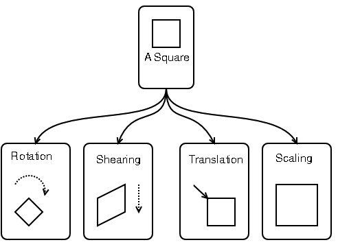
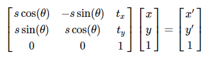

# 九点标定

## 1 . 基本概念

### 1.1 什么是九点标定

* 通常在eye-to-hand(固定相机)下使用, 即通过使用相机和机械臂获得空间中的多组相同点坐标值，从而建立机械臂与相机之间的坐标转换关系的过程.

### 1.2  仿射变换

* 仿射变换(Affine Transformation) 

  + 仿射变换是从一组二维坐标到另一组二维坐标之间的线性变换，保持二维图形的“平直性”（straightness，即变换后直线还是直线不会打弯，圆弧还是圆弧）和“平行性”（parallelness，其实是指保二维图形间的相对位置关系不变，平行线还是平行线，相交直线的交角不变。

  + 仿射变换可以通过一系列的原子变换的复合来实现，包括：平移（Translation）、缩放（Scale）、翻转（Flip）、旋转（Rotation）和剪切（Shear）。



* 仿射变换齐次矩阵形式



## 2. 一般流程

* 分别先获取9组标定板圆心与机器人位置坐标数据.

``` 

image_x:=[727.884,2395.058,1505.023,666.948,2678.36,1505.023,666.948,2678.36]
image_y:=[755.759,664.057,1289.824,1787.698,1707.432,1505.023,666.948,2678.36]
robot_x:=[-57.011,-33.521,-46.759,-58.678,-30.024,-46.759,-58.678,-30.024]
robot_y:=[323.965,324.565,316.237,309.794,309.695,-46.759,-58.678,-30.024]
```

* 根据之前获取的机器人坐标与标定板坐标, 计算出仿射矩阵.

``` 

vector_to_hom_mat2d (image_x, image_y, robot_x, robot_y, HomMat2D)
```

* 任取一个特征点，求得其像素坐标

``` 

img_x:=2094.344
img_y:=1326.878
```

* 通过以下算子即可把像素坐标转换成机器人坐标

``` 

affine_trans_point_2d(HomMat2D, img_x, img_y, Qx, Qy)
```

## 3. 相关算子

### 3.1 vector_to_hom_mat2d( : : Px, Py, Qx, Qy : HomMat2D)

*  vector_to_hom_mat2d从至少三个点的对应关系中近似地进行了一个仿射变换，并将其作为齐次变换矩阵HomMat2D返回.
* 点对应关系通过元组（Px，Py）和（Qx，Qy）中传递，其中对应点必须在元组中位于相同的索引位置。 如果传递了三个以上的点对应关系，则转换是不确定的。 在这种情况下，返回的变换是使输入点（Px，Py）与变换后的点（Qx，Qy）之间的距离最小的变换.

### 3.2 affine_trans_point_2d( : : HomMat2D, Px, Py : Qx, Qy)

* affine_trans_point_2d将齐次变换矩阵HomMat2D对应2D仿射变换（即缩放，旋转，平移和倾斜）应用于输入点（Px，Py），并返回（Qx，Qy）作为转换的结果.
