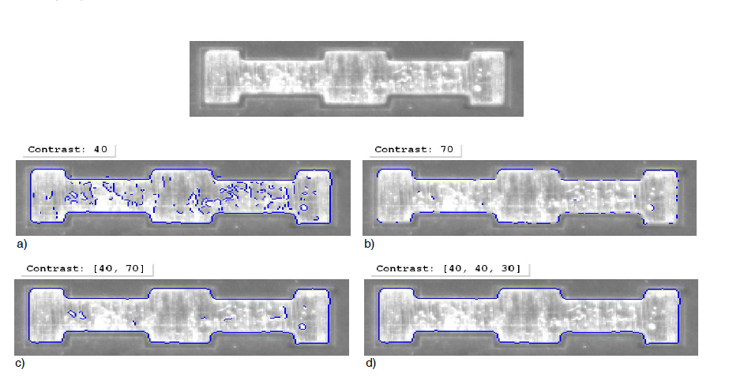

## 3.2 基于形状的匹配

* 基于形状的匹配不使用像素及其邻域的灰度值作为模板，而是通过轮廓的形状描述模型。 还可以通过有关相邻边缘的其他约束来扩展模型。

### 3.2.1 第一个例子

在本节中，我们将对基于形状的匹配过程进行快速概述。 

* 步骤1：在参考图片中选择对象

抓取参考图像后，第一个任务是创建一个包含对象的区域。 在示例程序中，使用算子gen_rectangle1创建一个矩形区域。 或者，您可以使用例如draw_rectangle1交互式绘制区域，也可以使用先前的细分过程产生的区域。 然后，使用算子reduce_domain创建仅包含所选区域的图像，即模板图像，结果如图3.2所示。

``` 

Row1 :=188
Column1 := 182
Row2 :=298
Column2 := 412
gen_rectangle1 (ROI, Row1, Column1, Row2, Column2)
reduce_domain (ModelImage, ROI, ImageROI)
```

* 第二步：创建模型

使用算子create_shape_model创建模型。 在此之前，我们建议应用算子inspect_shape_model，它可以帮助您找到合适的参数来创建模型。

``` 

inspect_shape_model，它可以帮助你找到合适的参数来创建模型。
inspect_shape_model (ImageROI, ShapeModelImages, ShapeModelRegions, 8, 30)
create_shape_model (ImageROI, NumLevels, 0, rad(360), 'auto', 'none', 'use_polarity', 30, 10, ModelID)
```

inspect_shape_model显示两个参数的影响，特别是在其上创建模型的金字塔级别的数量（NumLevels）和必须在模型中包括对象点的最小对比度（Contrast）。结果，算子inspect_shape_model返回所选金字塔等级上的模型点，如图3.2所示。因此，您可以检查该模型包含描述感兴趣对象的相关信息。

<!-- 使用算子create_shape_model实际创建模型时，可以指定除NumLevels和Contrast之外的其他参数。例如，您可以限制对象可以采用的角度范围（AngleStart和AngleExtent）以及创建模型的角度步长（AngleStep）。借助参数优化，您可以减少模型点的数量，这对于非常大的模型非常有用。参数Metric可让您指定是否必须遵守模型点的极性。最后，您可以指定要与模型进行比较的搜索图像中必须具有的最小对比度对象点（MinContrast）。的创造该模型在第55页的3.2.3节中详细介绍。 -->

<!-- 结果，算子create_shape_model返回新创建的模型（ModelID）的句柄，然后该句柄可用于指定模型，例如，在对算子find_shape_model的调用中。请注意，如果您使用HALCON的. NET或C++接口并通过类HShapeModel调用算子，则不会返回任何句柄，因为类的实例本身将充当您的句柄。 -->

<!-- 如果不仅允许方向变化，而且允许搜索对象的比例发生变化，则必须使用算子create_scaled_shape_model或create_aniso_shape_model创建模型。然后，您可以使用与用于角度范围的参数相似的参数来描述允许的比例范围。 -->

* 第三步：再找对象

要在搜索图像中找到对象，您需要做的就是调用算子find_shape_model。 图3.3显示了其中一个示例图像的结果。

``` 

for i := 1 to 20 by 1
grab_image (SearchImage, FGHandle)
find_shape_model (SearchImage, ModelID, 0, rad(360), 0.7, 1, 0.5,'least_squares', 0, 0.7, RowCheck, ColumnCheck, AngleCheck, Score)
endfor
```

<!-- 除了已经提到的ModelID，find_shape_model还提供了其他参数来优化搜索过程。在创建模型时已经指定的参数AngleStart，AngleExtent和NumLevels可让您在搜索过程中使用更多限制性值。通过为NumLevels使用值0，可以使用创建模型时指定的值。使用参数MinScore，您可以指定必须可见多少模型。大约为0.5的值意味着必须找到模型轮廓的一半。此外，您可以指定在图像中需要多少个对象实例（NumMatches），以及在图像中可以重叠多少个对象实例（MaxOverlap）。为了以亚像素精度计算找到的对象的位置，应将参数SubPixel设置为不同于“none”的值。

最后，参数Greediness描述了所使用的搜索试探法，范围从“安全但缓慢”（值0）到“快速但不安全”（值1）。有关如何优化搜索过程的详细信息，请参见第61页的3.2.4节。
算子find_shape_model返回每个找到的对象实例在参数行，列和角度以及它们相应的分数中的位置和方向。
如果您使用算子find_scaled_shape_model或find_aniso_shape_model（分别使用create_scaled_shape_model或create_aniso_shape_model创建模型后），则分别在Scale或ScaleR和ScaleC中返回找到的对象的比例。

以下各节将更深入地介绍基于形状的匹配的各个步骤以及必须调整的参数。 -->

### 3.2.2 选择ROI模型

作为基于形状的匹配的第一步，必须按照第17页的2.1.1节中所述选择指定模板图像的感兴趣区域。该区域可以具有任意形状，即，也可以包含孔或由未连接的几个部分组成。
在参考图像中存在杂波的情况下使用基于形状的匹配时，还可以使用算子inspect_shape_model通过其他图像处理来改善交互式选择的ROI。
<!-- 这在HDevelop示例程序％HALCONEXAMPLES％\ solution_guide \ matching \ process_shape_model.hdev中显示，该程序找到图3.4中所示的箭头。 -->
<!-- 第一步：选择箭头
在那里，在箭头周围创建一个初始ROI，而不试图排除杂乱无章的东西（见图3.4a）。

``` 

gen_rectangle1 (ROI, 361, 131, 406, 171)
reduce_domain (ModelImage, ROI, ImageROI)
```

第二步：创建第一个模型区域
然后，通过 inspect_shape_model 来检查这个 ROI。

``` 

inspect_shape_model (ImageROI, ShapeModelImage, ShapeModelRegion, 1, 30)
```

图3.4b显示了参数Contrast的不同值会创建的形状模型区域。
正如你所看到的，你不能在不损失箭头本身特征点的情况下，去除杂乱的部分。

第三步：对模型区域进行处理

该问题可以通过利用算子inspect_shape_model返回形状模型区域这一事实来解决。 因此，您可以像处理其他任何区域一样处理它。 摆脱混乱的主要思想是使用形态算子opening_circle，它消除了很小的区域。 在此之前，必须调用算子fill_up来填充箭头的内部，因为只有边界点才是（原始）模型区域的一部分。

``` 

fill_up (ShapeModelRegion, FilledModelRegion)
opening_circle (FilledModelRegion, ROI, 3.5)
```

第四步：创建最终模型
然后将得到的区域用于创建成功定位所有箭头的匹配模型。图3.4c
显示了处理后的区域、相应的兴趣区域和最终的模型区域。

``` 

create_shape_model (ImageROI, 3, 0, rad(360), 'auto', 'none', 'use_polarity', 30, 15, ModelID)
``` -->

### 3.2.3 创建一个合适的形状模型

从参考图像导出模板图像之后，可以创建形状模型。 请注意，基于形状的匹配包括在图像中找到训练对象的不同方法。 根据所选方法，使用以下算子之一创建模型：

* create_shape_model 创建一个简单的基于形状的匹配模型，使用模板图像进行匹配得出模型，并且支持不缩放。

* create_shape_model_xld为基于形状的简单匹配创建模型，该匹配使用XLD轮廓导出模型并且不支持缩放。

* create_scaled_shape_model为基于形状的匹配创建模型，该模型使用模板图像导出模型并支持统一缩放。
* create_scaled_shape_model_xld为基于形状的匹配创建模型，该模型使用XLD轮廓导出模型并支持统一缩放。
* create_aniso_shape_model为基于形状的匹配创建模型，该模型使用模板图像导出模型并支持各向异性缩放。
* create_aniso_shape_model_xld为基于形状的匹配创建模型，该模型使用XLD轮廓导出模型并支持各向异性缩放。

<!-- 请注意，如果您是从XLD轮廓导出模型的，则在第一次匹配后，强烈建议使用set_shape_model_metric确定模型的极性信息（有关详细信息，请参见第60页的3.2.3.5和第22页的2.1.3.2）。 -->
<!-- 在下文中，如果没有另外说明，则所描述的参数属于算子create_scaled_shape_model。 -->
```

create_scaled_shape_model(Template : : NumLevels, AngleStart, AngleExtent, AngleStep, ScaleMin, ScaleMax, ScaleStep, Optimization, Metric, Contrast, MinContrast : ModelID)

``` 

正如名称“基于形状的匹配”所暗示的那样，对象由其形状表示和识别。存在多种确定或描述对象形状的方法。在这里，形状通过选择相邻对比度超过某个阈值的所有那些点来提取。通常，这些点是对象轮廓的一部分。

* 特别是，您可以通过调整参数“Contrast”（第3.2.3.1节）来指定哪些像素是模型的一部分
* 通过调整参数AngleExtent，AngleStart和AngleStep可以控制对象的旋转范围, 起始弧度, 以及步长.
* 通过调整参数ScaleMin，ScaleMax和ScaleStep或各向异性缩放的相应参数（第59页的3.2.3.4节），允许特定范围的缩放。
* 通过调整参数MinContrast和Metric（第60页的3.2.3.5节），指定在以后的搜索中将哪些像素与模型进行比较。

#### 3.2.3.1 指定作为模型一部分的像素（对比度）

对于模型，选择那些像素，这些像素的对比度（即与相邻像素的灰度值之差）在调用create_shape_model或其等效项之一时超过参数Contrast指定的阈值。 为了获得合适的模型，应该以包括对象的重要像素的方式来选择对比度，即，将对象表征为有效的像素并允许将其与其他对象或背景清楚地区分开。 
显然，模型不应该包含杂乱，即不属于对象的结构。在某些情况下，不可能为 Contrast 找到一个单一的值，既能去除杂乱的结构，又能去除部分的结构的对象。 图3.5显示了一个示例。 任务是为垫的轮廓创建模型。 如果选择了完整的轮廓，则模型还将包含杂波（图3.5a）。 如果去除杂波，轮廓的一部分将丢失（图3.5b）。

    



图3.5：通过对比度选择重要的像素：a）完整的物体，包含杂乱；b）杂乱少，但不完整。
对象；c) 滞后阈值；d) 最小轮廓尺寸。

为解决此问题，参数“对比度”提供了两种附加方法：滞后阈值和根据轮廓尺寸选择轮廓部件。通过为“对比度”指定值的元组而不是单个值来使用这两种方法。

滞后阈值（另请参阅算子hysteresis_threshold）使用两个阈值，一个较低的阈值和一个较高的阈值。对于该模型，选择对比度高于上限阈值的第一像素。然后，添加对比度高于下阈值并直接或通过对比度高于下阈值的另一个像素连接到高对比度像素的像素。此方法使您可以选择对比度局部较低的轮廓零件。返回带有垫的示例：如图3.5c所示，具有滞后阈值，您可以为垫的完整轮廓创建模型，而不会造成混乱。以下代码行显示如何在元组中指定两个阈值：

```

inspect_shape_model (ImageReduced, ModelImages, ModelRegions, 2, [40, 70])

``` 

<!-- 消除混乱的替代方法是，如第54页的3.2.2节所述修改ROI或创建综合模型（请参见第20页的2.1.3.1节）。 -->
请注意，您可以通过为Contrast指定值“ auto”，让HALCON自己选择合适的值。 如果要指定三个对比度参数中的某些参数，然后让HALCON确定其余参数，请参阅参考手册以获取详细信息。
<!-- 
```

inspect_shape_model (ImageReduced, ModelImages, ModelRegions, 2, [40, 40, 30])

``` 

去除杂乱的其他方法是修改第54页3.2.2节所述的ROI，或创建一个新的ROI。
请注意，你可以通过为Contrast指定 "auto"值，让HALCON自己选择合适的值。 -->
<!-- #### 3.2.3.2 使用子采样和点还原加快搜索速度(NumLevels，Optimization)

为了加快匹配过程，可以使用子采样（另请参阅第25页的2.3.2节）。 在那里，创建了一个图像金字塔，包括原始的全尺寸图像和一组下采样图像。 然后在不同的金字塔等级上创建并搜索模型。
您可以通过参数NumLevels指定使用多少个金字塔等级。 我们建议选择最高金字塔等级，其中模型包含至少10-15像素，并且模型的形状仍与对象的形状相似。

一个更简单的方法是让HALCON自己选择一个合适的值，为NumLevels指定 "auto "值，然后通过算子get_shape_model_params查询使用的值。然后你可以通过算子get_shape_model_params查询使用的值。
可以通过参数Optimization来进一步减少模型点。在模型特别大的情况下，这可能对加快匹配速度很有用。同样，我们建议指定 "auto "这个值，让 HALCON 自己选择一个合适的值。请注意，无论您如何选择，所有通过对比度标准的点都会被显示，即您无法检查哪些点是模型的一部分。
通过可选的第二个值，您可以指定模型是否在允许的旋转和比例范围内完全预生成（见以下部分）。默认情况下，模型不预生成。 您可以通过将 "预生成 "作为 Optimization 的第二个值来预生成模型，从而可能加快匹配过程。 但请注意，如果您允许大范围的旋转和/或缩放，内存需求就会增加。另一个影响是，创建模型的过程需要的时间明显增加。在大多数情况下，不建议预生成模型。
需要注意的是，如果想手动设置金字塔层数，可以使用算子 inspect_shape_model 来检查模板图像金字塔，例如，在 HDevelop 程序中所示 
%HALCONEXAMPLES/solution_guide/matching/first_example_shape_matching.hdev. 在调用in- spect_shape_model之后，所选金字塔层上的模型区域会显示在HDevelop的图形窗口中。 你可以使用在线缩放（菜单项Visualization 1> Zoom Win- dow）来仔细观察它们。算子调用后的代码行循环通过金字塔并确定模型包含至少15个点的最高级别。然后在调用算子create_shape_model时使用这个值。

```

inspect_shape_model (ImageROI, ShapeModelImages, ShapeModelRegions, 8, 30)
area_center (ShapeModelRegions, AreaModelRegions, RowModelRegions, ColumnModelRegions)
count_obj (ShapeModelRegions, HeightPyramid)
for i := 1 to HeightPyramid by 1
if (AreaModelRegions[i - 1] >= 15)
NumLevels := i
endif
endfor
create_shape_model (ImageROI, NumLevels, 0, rad(360), 'auto', 'none', 'use_polarity', 30, 10, ModelID)

``` 

注意，算子 inspect_shape_model 以图像元组（数组）的形式返回金字塔图像。单个图像可以像模型区域一样，通过算子select_obj进行访问。请注意，对象元组以索引 1 开始，而控制参数元组以索引 0 开始。 -->

<!-- #### 3.2.3.3 允许方向范围（AngleExtent, AngleStart, AngleStep）。

如果对象的旋转在搜索图像中可能会有变化，你可以在参数AngleExtent中指定允许的范围，在参数AngleStart中指定这个范围的起始角度（单位：弧度）。请注意，旋转的范围是相对于参考图像而定义的，也就是说，起始角度为 0，对应于对象在参考图像中的方向。因此，如果要允许旋转到+/-5，例如，应该将起始角度设置为-rad(5)，角度范围设置为rad(10)。
请注意，在搜索过程中调用算子find_shape_model或其等效项之一时，您可以进一步限制允许的范围（请参阅第64页的3.2.4.2节）。 因此，如果要将模型重用于需要不同角度范围的不同任务，则可以在创建模型时使用较大范围，而在搜索时使用较小范围。
如果对象（几乎）是对称的，则应限制允许的范围。 否则，搜索过程将在同一对象上以不同角度找到多个几乎相同的匹配项。 因此，哪个匹配（以哪个角度）返回最佳状态可以在图像之间“跳转”。 合适的旋转范围取决于
对称性：对于十字形或正方形的对象，允许的范围必须小于90，对于矩形的对象，允许的范围必须小于180，对于圆形的对象，允许的范围必须为0（请参见图3.6）。

```

``` 

图3.6：旋转对称对象的合适角度范围。

如果您预先生成模型（请参见第58页），那么较大的旋转范围也会导致较高的内存需求。因此，在这种特殊情况下，建议在创建模型的过程中尽量限制允许的旋转范围 以加快搜索过程。
在匹配过程中，以参数AngleStep指定的步长在允许范围内的不同角度搜索模型。 如果选择值“ auto”，则HALCON会自动选择最佳步长opt1，以通过确定图像中仍可辨别的最小旋转来获得最高的精度。 图3.7中说明了基本算法：如果将距对象中心最远的点移动了至少2个像素，则可以清楚地看出十字形对象的旋转版本。 因此，对应角度opt 1的计算如下：

```

``` 

l是中心与对象边界之间的最大距离，d = 2个像素。 对于某些模型，这样估计的角度步长仍然太大。 在这种情况下，它会自动除以2。

```

``` 

图3.7：根据模型的范围确定最小角度步长尺寸。

自动确定的角度步长选择适用于大多数应用。 因此，我们建议选择值“ auto”。 您可以在创建后通过算子get_shape_model_params查询使用的值。 通过选择一个较高的值，可以加快搜索过程，但是会降低估计方向的准确性。 请注意，对于非常高的值，匹配可能会完全失败！
为AngleStep选择的值不应与最佳值相差太大。 注意，选择非常小的步长不会提高角度精度 -->

#### 3.2.3.4 允许比例范围(ScaleMin, ScaleMax, ScaleStep)

与方向范围类似，您可以指定允许的比例范围。 您可以采用两种形式进行缩放：

1. 行和列方向的缩放比例相同（缩放比例均匀）
2. 行和列方向的缩放比例不同（各向异性缩放比例）

要进行均匀缩放，使用算子create_scaled_shape_model的ScaleMin，ScaleMax和ScaleStep参数指定缩放范围。对于各向异性缩放，请改用算子create_aniso_shape_model，它具有六个缩放参数，而不是上面的三个。

请注意，在调用算子find_scaled_shape_model或find_aniso_shape_model时，您可以进一步限制允许的范围（请参阅第64页的3.2.4.2节）。因此，如果要将模型重用于需要不同比例范围的不同任务，则可以在创建模型时使用较大范围，而在搜索时使用较小范围。

要进行均匀缩放，请使用算子create_scaled_shape_model的ScaleMin，ScaleMax和ScaleStep参数指定缩放范围。对于各向异性缩放，请改用算子create_aniso_shape_model，它具有六个缩放参数，而不是上面的三个。
请注意，在调用算子find_scaled_shape_model或find_aniso_shape_model时，您可以进一步限制允许的范围（请参阅第64页的3.2.4.2节）。因此，如果要将模型重用于需要不同比例范围的不同任务，则可以在创建模型时使用较大范围，而在搜索时使用较小范围。
<!-- 如果您预先生成模型（请参见第58页），那么大范围的缩放也会导致对内存的高要求。因此，在这种特殊情况下，建议尽可能在模型创建过程中限制允许的比例范围，以加快搜索过程。
请注意，如果要在较大比例尺上搜索对象，则应基于较大比例尺创建模型，因为在以比原始比例尺更大的比例尺预先计算模型实例时，HALCON无法“猜测”模型点。另一方面，应选择NumLevels，以使最高级别也包含用于最小比例的足够模型点。 -->
<!-- 如果为参数ScaleStep（或各向异性缩放的等效项）选择值“ auto”，则HALCON将自动选择合适的步长，以通过确定图像中仍可识别的最小比例变化来获得最高的精度。与角度步长大小相似（请参阅第59页上的图3.7），如果距对象中心最远的点移动了至少2个像素，则可以清楚地从原始对象中分辨出缩放对象。因此，相应的比例变化1sopt计算如下：

l是中心与对象边界之间的最大距离，d = 2个像素。 对于某些模型，这样的估计比例步长仍然太大。 在这种情况下，它会自动除以2。
自动确定的刻度步长适用于大多数应用。 因此，我们建议选择值“ auto”。 通过选择一个较高的值，您可以加快搜索过程，但是会降低估计比例的准确性。 请注意，对于非常高的值，匹配可能会完全失败！为ScaleStep选择的值不应与最佳值（13 sopt s 3 sopt）相差太大。请注意，选择很小的步长不会导致以更高的比例精度！ -->

#### 3.2.3.5 指定将哪些像素与模型进行比较（MinContrast，Metric）

出于效率原因，模型包含影响搜索过程的信息：使用参数MinContrast，您可以指定搜索图像中的点至少必须具有哪种对比度才能与模型进行比较。此参数的主要用途是从匹配过程中排除噪声，即灰度值波动。您可以通过为MinContrast指定值“自动”，让HALCON自己选择合适的值。
由于根据参考图像中的噪声估算值，因此仅当期望参考图像中的噪声与搜索图像中的噪声相似时，自动参数选择才适用。如果使用不包含噪声的合成模型，则MinContrast会自动设置为0，并且必须手动将其设置为更高的值。
请注意，您也可以在以后的步骤中使用set_shape_model_param更改MinContrast的值（请参阅第69页的3.2.4.10节）。
参数Metric可让您指定是否以及如何遵守极性，即必须遵守对比的方向（见图3.8）。如果选择值'use_polarity'，则会观察到极性，即，搜索图像中的点必须显示与模型中相应点相同的对比度方向。如果，例如模型是深色背景上的明亮对象，只有在该对象也比背景明亮时才能在搜索图像中找到该对象。
您可以通过选择值'ignore_global_polarity'选择全局忽略极性。在此模式下，如果对象的对比度方向相反，例如，如果您的对象在浅色背景上既可以显示为深色，反之亦然，则也可以识别该对象。但是，这种灵活性是以稍低的识别速度为代价的。

如果选择值“ ignore_local_polarity”，即使对比度在本地发生变化，也会找到对象。 例如，如果对象由具有中等灰度值的部分组成，则其中可能包含较暗或较亮的子对象，则此模式很有用。 但是请注意，在此模式下，识别速度和鲁棒性可能会急剧下降，尤其是在允许大范围旋转的情况下（请参阅第58页的3.2.3.3节）。

如果选择值“ ignore_color_polarity”，则可以在彩色图像中（或更普遍地，在多通道图像中）执行匹配。
<!-- 一个示例是％HALCONEXAMPLES％\ hdevelop \ Applications \ PositionRecognition-2D \ matching_multi_channel_yogurt.dev。 -->
如果您是根据XLD轮廓创建模型的，则没有可用的关于模型极性的信息，因此在创建模型时，必须将Metric的值设置为'ignore_local_polarity'。首次匹配成功后，可以使用匹配结果来获取将轮廓投影到搜索图像上所需的转换参数（使用vector_angle_to_rigid）。然后，使用算子set_shape_model_metric可以确定第一个搜索图像的极性，该极性用作该极性的训练图像，并将匹配度量设置为'use_polarity'或'ignore_global_polarity'。使用值“ use_polarity”，即，如果以下搜索图像的极性与训练图像的极性相同，搜索变得更快，更强大。
<!-- 一个示例是％HALCONEXAMPLES％\ hdevelop \ Matching \ ShapeBased \ create_shape_model_xld.dev。请注意，set_shape_model_metric仅适用于根据XLD轮廓创建的模型！ -->

### 3.2.4优化搜索过程   

实际匹配由以下算子之一执行：
基于形状

* find_shape_model搜索单个模型的实例，如果模型的实例的比例可能不变化，则使用find_shape_model，
* find_shape_models同时搜索多个模型的实例，如果模型的实例的比例可能不变化，则使用find_shape_models，
* find_scaled_shape_model搜索单个模型的实例，如果允许统一缩放，则使用find_scaled_shape_model，
* find_scaled_shape_models同时搜索多个模型的实例，并在允许统一缩放的情况下使用，
* find_aniso_shape_model搜索单个模型的实例，如果允许在行和列方向上使用不同的缩放因子，则使用find_aniso_shape_model
* find_aniso_shape_models同时搜索多个模型的实例，如果允许在行和列方向上使用不同的比例因子，则将使用它们。

在下文中，我们展示了如何为这些算子选择合适的参数以适应和优化匹配任务。特别是，我们展示了如何执行任务。

* 将搜索空间限制在感兴趣的区域（第3.2.4.1节），
* 通过参数AngleStart，AngleExtent，ScaleMin和ScaleMax或各向异性缩放的相应参数来限制方向和缩放范围，从而限制搜索空间（第64页的3.2.4.2节），
* 将搜索空间限制为对象允许的特定遮挡量，即，通过参数MinScore（第64页的3.2.4.3节）指定对象的可见性，
* 将搜索限制在相对于模型轮廓指定的区域内没有（或太微弱）混乱边缘的候选对象（第65页的3.2.4.4节），
* 通过调整参数贪婪度（第65页第3.2.4.5节），指定使用的搜索试探法，即交易彻底性与速度。
* 通过调整参数NumMatches和MaxOverlap搜索模型的多个实例（第66页的3.2.4.6节），
* 通过调整参数ModelID（第66页的3.2.4.7节）同时搜索多个模型，
* 通过调整参数SubPixel（第68页的3.2.4.8节）来指定结果所需的精度，
* 限制搜索过程的金字塔级别数（NumLevels）（第69页的3.2.4.9节），
* 通过算子set_shape_model_param（第69页的3.2.4.10节）设置参数“超时”和“ min_contrast”，以及
* 优化匹配速度（第70页的3.2.4.11节）。

请注意，许多匹配方法只能用于搜索图像中单个模型的单个实例，而基于形状的匹配还可以用于同时搜索多个模型的多个实例。

#### 3.2.4.1将搜索限制在感兴趣的区域

限制搜索空间的一种明显方法是不将算子find_shape_model（或其等效项之一）应用于整个图像但仅限于ROI。 图3.9显示了这样一个示例。 搜索空间的减少可以用几行代码来实现。
步骤1：建立感兴趣的区域
首先，例如使用算子gen_rectangle1创建一个区域（有关创建区域的更多方法，请参见第17页的2.1.1节）。

```

Row1 := 141
Column1 := 159
Row2 := 360
Column2 := 477
gen_rectangle1 (SearchROI, Row1, Column1, Row2, Column2)

``` 

步骤2：将搜寻范围限制在感兴趣的区域
然后，使用算子reduce_domain将每个搜索图像缩小到此ROI。 在此示例中，使用该方法的搜索速度几乎翻了一番。

```

for i := 1 to 20 by 1
grab_image (SearchImage, FGHandle)
reduce_domain (SearchImage, SearchROI, SearchImageROI)
find_shape_model (SearchImageROI, ModelID, 0, rad(360), 0.7, 1, 0.5, 'interpolation', 0, 0.7, RowCheck, ColumnCheck, AngleCheck, Score)
endfor

``` 

请注意，通过将搜索范围限制为ROI，实际上可以限制模型参考点的位置，即模型ROI的重心（请参阅第18页的2.1.2节）。 这意味着搜索ROI的大小对应于允许移动的程度。 例如，如果您的对象可以移动+-10像素
垂直和水平+-15像素，您可以将搜索范围限制为20 * 30的ROI。 为了确保在较高的金字塔等级上进行正确的边界处理，我们建议在每个方向上将ROI扩大2NumLevels-1个像素。 因此，如果您指定NumLevels = 4，则可以将搜索限制为大小为36 * 46的ROI。
请注意，即使您使用set_shape_model_origin修改了参考点（不建议使用），在搜索过程中也会使用原始参考点，即模型ROI的中心点。 因此，您必须始终指定相对于原始参考点的搜索ROI。

####  3.2.4.2限制方向和比例的范围（AngleStart，AngleExtent，ScaleMin，ScaleMax）

创建模型时，您已经指定了方向和比例的允许范围（请参阅第58页的3.2.3.3节和第59页的3.2.3.4节）。调用算子find_shape_model或其等效项之一时
您可以使用参数AngleStart，AngleExtent，ScaleMin和ScaleMax（或各向异性缩放的相应缩放参数）进一步限制这些范围。如果您可以通过其他信息（例如，可以通过适当的图像处理操作获得这些信息）来限制这些范围，则此功能很有用。
创建模型时使用更大范围的另一个原因可能是您还希望将模型重用于其他匹配任务。
请注意，如果用于创建模型的比例范围大于用于搜索的范围，则即使在稍微受限的比例范围之外，也可能会在搜索图像中找到该模型。

####  3.2.4.3指定对象的可见性（MinScore）

使用参数MinScore，您可以指定必须可见多少模型。如图3.10所示，此机制的典型用法是允许一定程度的遮挡：如果将MinScore设置为0.7，则会找到安全环。
让我们仔细看一下“可见性”一词：当将搜索图像的一部分与模型进行比较时，匹配过程会计算出所谓的得分，该得分主要是衡量多少模型点可以匹配到模型中的点。搜索图像（范围从0到1）。一个模型点可能是“不可见的”，因此由于多种原因而无法匹配：
例如，如图3.10所示，对象轮廓的某些部分被遮挡了。
•请注意，默认情况下，如果图像边缘被裁剪，则找不到对象。可以使用set_system（'border_shape_models'，'true'）更改此行为。一个例子是
％HALCONEXAMPLES％\ hdevelop \ Applications \ Position-Recognition-2D \ matching_image_border.dev。
请注意，在这种模式下，搜索的运行时间将增加。

* 创建模型时，轮廓的某些部分的对比度低于参数MinContrast中指定的对比度（请参见第60页的3.2.3.5节）。

* 对比度的极性全局或局部变化（请参阅第60页的3.2.3.5节）。
* 如果物体变形（包括相机以倾斜角度观察​​场景的情况），轮廓的某些部分可能可见，但出现在不正确的位置，并且

因此不再适合该模型。请注意，如果您将参数“ SubPixel”设置为
“ max_deformation”（请参见第68页的3.2.4.8节）。此外，如果增加公差模式被激活，可能会发现变形或散焦的物体。为此，最低金字塔等级
在NumLevels中否定地指定。然后，返回仍提供匹配项的最低金字塔级别的匹配项。在第74页的3.2.6节中介绍了如何处理由于摄像机倾斜而发生的透视变形的特殊情况。

例如，如图3.10所示，对象轮廓的某些部分被遮挡了。

* 请注意，默认情况下，如果图像边缘被裁剪，则找不到对象。可以使用set_system（'border_shape_models'，'true'）更改此行为。一个例子是

％HALCONEXAMPLES％\ hdevelop \ Applications \ Position-Recognition-2D \ matching_image_border.dev。
请注意，在这种模式下，搜索的运行时间将增加。

* 创建模型时，轮廓的某些部分的对比度低于参数MinContrast中指定的对比度（请参见第60页的3.2.3.5节）。

* 对比度的极性全局或局部变化（请参阅第60页的3.2.3.5节）。
* 如果物体变形（包括相机倾斜角度观察​​场景的情况），轮廓的某些部分可能可见，但出现在不正确的位置，因此不再适合模型。请注意，如果将参数“ SubPixel”设置为“ max_deformation”，则可能会发现变形的对象（请参阅第68页的3.2.4.8节）。此外，如果增加公差模式被激活，可能会发现变形或散焦的物体。为此，必须在NumLevels中否定最低金字塔等级。然后，返回仍提供匹配项的最低金字塔级别的匹配项。在第74页的3.2.6节中介绍了如何处理由于摄像机倾斜而发生的透视变形的特殊情况。

除了这些根植于搜索图像的明显原因外，还有一些不那么明显的原因是由匹配过程本身引起的。
如第58页的3.2.3.3节所述，HALCON在允许的方向范围内预先计算中间角度的模型。在搜索过程中，一个候选匹配点会与所有预计算的模型实例进行比较。如果您为参数 AngleStep 选择的值明显大于自动选择的最小值，则会出现图 3.11 所示的效果。如果对象位于两个预计算的角度之间，远离中心的点就不会与模型点相匹配，因此得分会降低。
当然，同样的道理也适用于参数ScaleStep和它的各向异性缩放的变体（见第59页的3.2.3.4节）。
另一个障碍在于图像金字塔的使用，这在第 58 页的 3.2.3.2 节中介绍过。当将候选匹配与模型进行比较时，必须在每个金字塔级别上达到指定的最低分数。然而，在不同的层次上，分数可能会有所不同，只有最低层次上的分数才会在参数 Score 中返回。这有时会导致明显的悖论情况，即MinScore必须设置为明显低于结果的Score。请注意，如果不跟踪匹配到最低的金字塔级别，可能会发现分数略低于MinScore的实例。
建议。MinScore越高，搜索速度越快!

#### 3.2.4.4使用杂波参数限制搜索

在某些情况下，尽管在搜索图像中找到了多个具有较高“得分”值的匹配项，但并非所有人都希望将其作为结果。例如，在图3.12中，尽管仅搜索由八个点组成的结构，但发现了更多实例。为了仅获得所需的匹配，必须区分实例。可以考虑将对象附近没有边缘作为独特特征来完成此操作。
要将搜索限制在相对于模型轮廓指定的区域内没有（或太模糊）边缘的候选者，可以使用set_shape_model_clutter，它定义了杂波区域及其各自的参数。
有关如何调整杂波参数的更多信息，请参阅《参考手册》中有关算子的说明。

#### 3.2.4.5交易彻底性与速度（贪婪）

使用参数Greediness，您可以影响搜索算法本身，从而以速度为代价交换完整性。如果选择值0，则搜索是彻底的，即，如果存在对象（并且在允许的搜索空间内并且达到最低分数），则会找到该对象。但是，在这种模式下，即使是非常不可能的匹配候选者也会被彻底检查，从而大大减慢了匹配过程。
“贪婪”搜索算法背后的主要思想是，在不太可能达到最低分数的情况下，将候选对象与模型进行比较。换句话说，目标是不要在无望的候选人身上浪费时间。但是，这种贪婪可能会带来不受欢迎的后果：在某些情况下，找不到完美可见的对象，因为比较“始于错误的脚”，因此被归类为无望的候选人并中断了。
您可以通过选择0（无中断：彻底但缓慢）和1（最早中断：快速但不安全）之间的值来调整搜索的贪婪度，即终止比较的时间。请注意，参数Greediness和MinScore会相互影响，即，您可能必须指定较低的最低分才能使用greedier搜索。通常，您可以以较高的贪婪度和足够低的最低分数来达到较高的速度。

<!-- #### 3.2.4.6搜索对象的多个实例（NumMatches，MaxOverlap）

搜索对象的一个​​以上实例所需要做的就是相应地设置参数NumMatches。算子find_shape_model（或其等价之一）然后将匹配结果作为元组返回到参数Row，Column，Angle，Scale中（或其各向异性缩放的变体）和得分。如果选择值0，则返回所有匹配项。
请注意，搜索多个对象仅比搜索单个对象慢一点。
第二个参数MaxOverlap可让您指定两个匹配项可能重叠的部分（分数）。在图3.13b中，例如，两个安全环的重叠系数约为0.2。为了尽可能加快匹配速度，无论是模型本身还是模型的投资回报率都不会计算重叠
但要使其周围的矩形最小。在指定最大重叠量时必须牢记这一点。因此，在大多数情况下，需要更大的值（例如，比较图3.13b和图3.13d）。
图3.13e显示了一个“病理”情况：即使环本身不重叠，但其周围的矩形在很大程度上也是如此。不幸的是，这种效果无法避免。 -->

<!-- #### 3.2.4.7同时搜索多个模型（ModelID）

如果要在单个图像中搜索多个模型的实例，则当然可以多次调用算子find_shape_model, find_scaled_shape_model或find_aniso_shape_model。但是更快的替代方法是改为使用算子find_shape_models，find_scaled_shape_models或find_aniso_shape_models。这些算子期望相似的参数，但有以下差异：
•使用参数ModelIDs，您可以指定一个模型ID的元组，而不是一个。与搜索多个实例时一样（请参阅第3.2.4.6节），匹配结果参数Row等将返回值的元组。
•输出参数Model显示每个找到的实例属于哪个模型。请注意，该参数不会返回模型ID本身，而是返回元组中模型ID的索引ModelID（从0开始）。
•搜索总是在单个图像中执行。但是，您可以通过传递图像数组将搜索范围分别限制为每个模型的特定区域（请参见下面的示例）。
•您可以通过为AngleStart等指定单个值来对每个模型使用相同的搜索参数，或者传递包含每个模型的单个值的元组。
•您还可以搜索多个模型的多个实例。如果搜索与对象类型（型号ID）无关的一定数量的对象，请在参数NumMatches中指定此（单个）值。通过传递值的元组，可以为每个模型分别指定要查找的实例数。元组[3, 0]，例如，指定返回第一个模型的最佳三个实例和第二个模型的所有实例。
同样，如果为MaxOverlap指定单个值，则算子将检查找到的实例是否被其他任何实例所覆盖，而与它们的类型无关。通过指定值的元组，将仅对照相同类型的所有其他实例检查每个实例。

步骤1：建立模型
首先，创建两个模型，一个用于环，一个用于螺母。然后使用算子assign将两个模型ID连接成一个元组。

```

gen_rectangle1 (SearchROIRing, 110, 10, 130, Width - 10)
gen_rectangle1 (SearchROINut, 315, 10, 335, Width - 10)
concat_obj (SearchROIRing, SearchROINut, SearchROIs)
add_channels (SearchROIs, SearchImage, SearchImageReduced)

``` 

步骤2：指定单个搜索ROI
在本例中，环和螺母出现在搜索图像的非重叠部分。因此，可以单独限制每个模型的搜索空间。正如第63页的3.2.4.1节所解释的那样，搜索ROI对应于允许移动的范围。因此，在例子中可以使用狭窄的水平 ROI（见下图）。
图3.14b）。)
使用算子concat_obj将两个ROI连成一个区域数组（元组），然后使用算子add_channels将其 "添加 "到搜索图像中，即在每个区域中 "绘制 "搜索图像的相应灰度值。该算子的结果是一个由两幅图像组成的数组，这两幅图像都具有相同的图像矩阵. 第一幅图像的域被限制在第一个ROI上，第二幅图像的域被限制在第二个ROI上。

```

gen_rectangle1 (SearchROIRing, 110, 10, 130, Width - 10)
gen_rectangle1 (SearchROINut, 315, 10, 335, Width - 10)
concat_obj (SearchROIRing, SearchROINut, SearchROIs)
add_channels (SearchROIs, SearchImage, SearchImageReduced)

``` 

步骤3：找到两个模型的所有实例。
现在，算子 find_scaled_shape_models 被应用于创建的图像数组。因为这两个模型允许不同的旋转和缩放范围，所以要为相应的参数指定元组。相反，其他参数对两个模型都有效。第 72 页的 3.2.5.2 节介绍了如何访问匹配结果。

```

find_scaled_shape_models (SearchImageReduced, ModelIDs, [-rad(22.5), \
-rad(30)], [rad(45), rad(60)], [0.8, 0.6], [1.2, \
1.4], 0.7, 0, 0, 'least_squares', 0, 0.8, \
RowCheck, ColumnCheck, AngleCheck, ScaleCheck, \
Score, ModelIndex)

```  -->

#### 3.2.4.8 指定所需的精度 (子像素)

在匹配过程中，候选匹配对象与不同位置、角度和尺度的模型实例进行比较。对于每个实例，都会计算出结果的匹配分数。如果您将参数 SubPixel 设置为 "none"，则计算出的参数 Row、Column、Angle 和 Scale（或对应的参数 SubPixel 为 "none"）。
各向异性缩放）包含最佳匹配的相应值。在这种情况下，位置的精度因此是 1 个像素，而方向和比例的精度等于创建模型时分别为参数 AngleStep 和 ScaleStep（或各向异性缩放的相应参数）选择的值（见第 58 页的 3.2.3.3 节和第 59 页的 3.2.3.4 节）。
如果将参数SubPixel设置为 "插值"，HALCON会检查最佳匹配点周围相邻位置、角度和尺度的匹配分数，并通过插值确定最大值。因此，使用这种方法，可以用亚像素的精度来估计位置（可以达到120像素）。准确度估计的方向和比例取决于物体的大小，就像AngleStep和ScaleStep参数的最佳值或各向异性缩放的相应参数一样(参见第58页的3.2.3.3和第59页的3.2.3.4)。尺寸越大，方向和比例的确定就越准确。例如，如果中心和边界之间的最大距离是100像素，方向的确定精度通常为1/10。
建议：由于插值非常快，因此您可以在大多数应用程序中将SubPixel设置为“插值”。
当您将参数SubPixel设置为'least_squares'，'least_squares_high'或'least_squares_very_high'，使用最小二乘平差代替插值，从而获得更高的精度。但是，此方法需要额外的计算时间。
有时，由于对象与模型相比有轻微的变形，所以没有找到对象或只找到了较低的精度。如果您的对象很可能是变形的，您可以通过设置 SubPixel 附加的 'max_deformation'来允许模型有几个像素的最大变形，后面是允许变形的像素数。例如，如果您将SubPixel设置为'max_deformation 2'，则搜索对象的轮廓可能与模型的形状相差最多两个像素。为了得到一个有意义的分数值，并避免错误的匹配，我们建议总是将变形的允许值与最小二乘法调整相结合。需要注意的是，最大允许变形的高值会增加运行时间和发现错误模型实例的风险，特别是对于小模型。因此，该值应选择尽可能小的，但也要尽可能高。
请注意，如果使用set_shape_model_origin修改参考点，则估计位置的准确性可能会降低！在图3.15中可以看到这种效果：如您在最右边的列中所见，估计方向的不准确性“移动”了修改的参考点，而原始点
参考不受影响。产生的位置误差取决于多个因素，例如，参考点的偏移和找到的对象的方向。要记住的主要一点是，误差随着修改后的参考点与原始参考点的距离线性增加（比较图3.15中的两行）。
估计比例尺的不准确还会导致估计位置的误差，误差还会随着修改后的参考点与原始参考点之间的距离线性增加。为了在参考点移动的情况下获得最大的精度，应该使用最小二乘法调整来确定位置。注意，估计的方向和比例尺的精度不受修改参考点的影响。

#### 3.2.4.9限制金字塔等级的数量（NumLevels）

创建模型时已经指定的参数NumLevels允许您在搜索过程中使用不同的值（在大多数情况下，限制更大）。通过为NumLevels使用值0，可以使用创建模型时指定的值。
（可选）NumLevels可以包含第二个值，以便您不仅可以指定用于搜索的最高金字塔等级，还可以指定最低金字塔等级。如果在高于第一金字塔等级（对应于原始的全尺寸图像）的金字塔等级上完成搜索，则搜索会变得更快。另一方面，搜索也因此不那么健壮，也不那么准确。如果还应在质量差的图像中找到对象，例如，如果对象散焦，变形或嘈杂，则可以通过负数指定第二个值来激活增加的公差模式。然后，返回仍提供匹配项的最低金字塔级别的匹配项。如果高噪声影响匹配结果，您也可以使用Adapt_shape_model_high_noise来估计形状模型的最低金字塔等级。
<!-- 

#### 3.2.4.10 通过set_shape_model_param设置参数'min_contrast'和'timeout'

大多数参数是在形状模型的创建过程中设置的。 稍后也可以使用算子set_shape_model_param设置两个参数。 特别是，您可以设置参数“ min_contrast”和“ timeout”。 例如，如果某些搜索图像的对比度太低，则可以更改“ min_contrast”。 只能使用set_shape_model_param设置“超时”，而不能在模型创建期间设置。 使用它，您可以指定可以保证搜索终止的最长时间，即可以使搜索可中断。 但是请注意，对于中断的搜索，不会返回任何结果。 此外，设置超时机制时，搜索的运行时间可能会增加多达10％。 示例％HALCONEXAMPLES％\ hdevelop \ Matching \ Shape-Based \ set_shape_model_timeout.hdev显示了如何使用超时机制。 -->

#### 3.2.4.11 优化匹配速度

在下面的内容中，我们将展示如何通过两个步骤来优化匹配过程。请注意，为了优化匹配，非常重要的是要从您的应用程序中获得一组具有代表性的测试图像，在这些图像中，对象出现在所有允许的位置、方向、遮挡和照明方面的变化。
步骤1：确保找到所有对象
在调整速度参数之前，我们建议找到设置以使匹配在所有测试图像中都成功，即找到所有对象实例。如果使用默认值不是这种情况，请检查以下情况之一是否适用：
对象是否在图像边界处被剪切？
设置set_system（'border_shape_models'，'true'）（请参见第64页的3.2.4.3节）。
搜索算法是否“过于贪婪”？
如第65页的3.2.4.5节中所述，在某些情况下，如果贪婪度太高，则找不到完美可见的对象。选择值0强制进行彻底搜索。
对象被部分遮挡了吗？
如果仍应在此状态下识别对象，请减少参数MinScore。
匹配是否在最高金字塔级别失败？
如第64页的3.2.4.3节所述，在某些情况下，即使最低金字塔等级的分数高得多，也无法在最高金字塔等级上达到最低分数。通过减少对find_shape_model或其等效项之一的调用中的NumLevels来进行测试。或者，减少MinScore。
物体对比度低吗？
但是，如果仍应在此状态下识别对象，请减小参数MinContrast（请参见第60页的3.2.3.5节）。
对比度的极性是全局反转还是局部反转？
如果仍应在此状态下识别对象，则在创建模型时，请为参数Metric使用适当的值（请参阅第60页的3.2.3.5节）。如果只有一小部分是
受此影响，最好改为减少MinScore。
对象是否与该对象的另一个实例重叠？
但是，如果仍应在此状态下识别对象，请增加参数MaxOverlap（请参阅第66页的3.2.4.6节）。
是否在同一对象上找到多个匹配项？
如果对象几乎是对称的，则按照第58页的3.2.3.3节中所述限制旋转的允许范围，或减小参数MaxOverlap（请参见第66页的3.2.4.6节）。
步骤2：调整速度参数
匹配过程的速度取决于模型和搜索参数。为了使事情变得更加困难，搜索参数取决于所选的模型参数。我们建议执行以下步骤：

•尽可能增加MinScore，即，只要匹配成功即可。
•现在，增加贪婪度，直到匹配失败。尝试减少MinScore。如果这样不能帮助恢复以前的值。
•如果可能，在创建模型时为NumLevels使用较大的值。
•尽可能限制旋转和缩放的允许范围，如第58页的3.2.3.3节和第59页的3.2.3.4节所述。或者，在调用find_shape_model，find_scaled_shape_model或find_aniso_shape_model时调整相应的参数。
•如第63页的3.2.4.1节所述，将搜索限制在感兴趣的区域。
•确保模型包含许多轮廓点，并且轮廓具有可与图像中其他结构清晰地区分的主要结构。也就是说，在拍摄图像并准备模型时，您可以通过优先选择具有优势结构的较大模型而不是具有弱结构的较小模型来显着影响搜索速度（另请参见第19页的第2.1.2.2节和第2.3.2节）在第25页）。

以下方法更“危险”，即，如果选择不合适的参数值，则匹配可能会失败。
•只要匹配成功，就增加MinContrast。
•如果要搜索特别大的对象，通常可以使用“优化”参数来选择更高的减少点（请参见第58页的3.2.3.2节）。
•只要匹配成功，就增加AngleStep（和ScaleStep或各向异性缩放的相应参数）。
•如果匹配的速度比其鲁棒性和准确性更重要，请按照第69页3.2.4.9节中所述在较高的金字塔等级上终止搜索。
请注意，对于上述许多优化，您还可以使用HDevelop Matching Assistant来指导您完成整个匹配过程的不同步骤。 《 HDevelop用户指南》第211页的7.3节中介绍了如何使用Matching Assistant。

### 3.2.5使用基于形状的匹配的特定结果

基于形状的匹配结果可用于第28页第2.4节中介绍的所有任务，以进行常规匹配。 此外，基于形状的匹配可以返回一个模型的多个实例，并且可以同时处理多个模型。 在3.2.5.1节和3.2.5.2节中描述了如何使用这些特定结果。

<!-- #### 3.2.5.1 处理多重匹配问题

如果搜索并找到对象的多个实例，参数Row、Column、Angle和Score包含tuple。HDevelop程序%HALCONEXAMPLES%/solution_guide/matching/multiple_objects.hdev展示了如何在循环中访问这些结果。

步骤1：确定仿射变换
如第33页的2.4.3.1节所述，确定与匹配的运动相对应的转换。与搜索单个匹配项相反，此处，通过循环变量从元组中提取匹配项的位置。

``` 

find_shape_model (SearchImage, ModelID, 0, rad(360), 0.6, 0, 0.55'least_squares',0, 0.8, RowCheck, ColumnCheck, AngleCheck, Score)
for j := 0 to |Score| - 1 by 1
vector_angle_to_rigid (0, 0, 0, RowCheck[j], ColumnCheck[j], AngleCheck[j], MovementOfObject)
affine_trans_contour_xld (ShapeModel, ModelAtNewPosition, MovementOfObject)

```

步骤2：使用转换
在此示例中，转换还用于显示可视化方向的箭头（请参见图3.16）。
为此，使用affine_trans_pixel使用与！相同的转换矩阵对箭头的位置进行转换。 用于XLD模型。 如第34页的2.4.3.2节所述，您必须使用affine_trans_pixel而不是affine_trans_point_2d。

``` 

affine_trans_pixel (MovementOfObject, -120, 0, RowArrowHead, ColumnArrowHead)
disp_arrow (WindowHandle, RowCheck[j], ColumnCheck[j], RowArrowHead, \
ColumnArrowHead, 2)

```  -->

<!-- #### 3.2.5.2处理多种模型

如第66页的3.2.4.7节所述，同时搜索多个模型时，将有关模型的信息（即XLD模型）存储在元组中很有用。以下示例代码源于已经部分描述的HDevelop程序％HALCONEXAMPLES％\ solution_guide \ matching \
multiple_models.hdev，它使用算子find_scaled_shape_models同时搜索第68页的图3.14中所示的环和螺母。

步骤1：访问XLD模型
使用算子get_shape_model_contours访问与两个模型相对应的XLD轮廓。

```

create_scaled_shape_model (ImageROIRing, 'auto', -rad(22.5), rad(45), \
'auto', 0.8, 1.2, 'auto', 'none', \
'use_polarity', 60, 10, ModelIDRing)
inspect_shape_model (ImageROIRing, PyramidImage, ModelRegionRing, 1, 30)
get_shape_model_contours (ShapeModelRing, ModelIDRing, 1)
create_scaled_shape_model (ImageROINut, 'auto', -rad(30), rad(60), 'auto', \
0.6, 1.4, 'auto', 'none', 'use_polarity', 60, \
10, ModelIDNut)
inspect_shape_model (ImageROINut, PyramidImage, ModelRegionNut, 1, 30)
get_shape_model_contours (ShapeModelNut, ModelIDNut, 1)

``` 

步骤2：将有关模型的信息保存在元组中
为了便于以后访问形状模型，将XLD轮廓类似于模型ID保存在元组中（请参阅第66页的3.2.4.7节）。 但是，将XLD轮廓与算子concat_obj串联时，必须记住XLD对象已经是元组，因为它们可能包含多个轮廓！ 因此，要访问属于某个模型的轮廓，您需要一个模型的轮廓数和连接的元组中的起始索引。 前者是使用算子count_obj确定的。 环的轮廓从索引1开始，螺母的轮廓从索引1开始加上环的轮廓数量。

```

count_obj (ShapeModelRing, NumContoursRing)
count_obj (ShapeModelNut, NumContoursNut)
ModelIDs := [ModelIDRing, ModelIDNut]
concat_obj (ShapeModelRing, ShapeModelNut, ShapeModels)
StartContoursInTuple := [1, NumContoursRing + 1]
NumContoursInTuple := [NumContoursRing, NumContoursNut]

``` 

步骤3：访问找到的实例
如第72页的3.2.5.1节中所述，如果有多个匹配项，则输出参数Row等包含值的元组，通常使用循环变量作为元组的索引在循环中访问这些值。当搜索多个模型时，将涉及第二个索引：输出参数Model通过将相应模型ID的索引存储在参数ModelIDs指定的ID元组中来指示匹配项属于哪个模型。这听起来可能令人困惑，但是可以在代码中以优雅的方式实现：对于每个找到的实例，使用模型ID索引从上面创建的元组中选择相应的信息。
如前所述，表示模型的XLD可以包含多个轮廓。因此，您不能使用算子select_obj直接访问它们。取而代之的是，通过算子copy_obj选择属于模型的轮廓，并指定模型在连接的元组中的起始索引以及轮廓的数量作为参数。请注意，copy_obj不复制轮廓，而仅复制相应的HALCON对象，可以将其视为轮廓的引用。

```

find_scaled_shape_models (SearchImageReduced, ModelIDs, [-rad(22.5), \
-rad(30)], [rad(45), rad(60)], [0.8, 0.6], [1.2, \
1.4], 0.7, 0, 0, 'least_squares', 0, 0.8, \
RowCheck, ColumnCheck, AngleCheck, ScaleCheck, \
Score, ModelIndex)
for i := 0 to |Score| - 1 by 1
Model := ModelIndex[i]
get_hom_mat2d_from_matching_result (RowCheck[i], ColumnCheck[i], \
AngleCheck[i], ScaleCheck[i], \
ScaleCheck[i], \
MoveAndScalingOfObject)
copy_obj (ShapeModels, ShapeModel, StartContoursInTuple[Model], \
NumContoursInTuple[Model])
affine_trans_contour_xld (ShapeModel, ModelAtNewPosition, \
MoveAndScalingOfObject)
dev_display (ModelAtNewPosition)
endfor
``` -->

<!-- ### 3.2.6适应变化的相机方向

如上节所示，HALCON的基于形状的匹配允许对对象进行定位，即使它们在图像中的位置和方向或比例发生了变化。但是，如果摄像机以倾斜角度观察​​场景，即，如果它没有垂直指向对象移动的平面，则基于形状的匹配将失败，因为对象会由于透视投影而出现扭曲。更糟糕的是，变形会随着对象的位置和方向而变化。
在这种情况下，您一方面可以在应用匹配之前校正图像。这是一个三步过程：首先，您必须使用算子calibrate_cameras校准摄像机，即确定其位置和方向以及其他参数（请参阅解决方案指南III-C，第59页的3.2节）。其次，校准数据用于通过算子gen_image_to_world_plane_map创建映射函数，然后将其应用于带有算子map_image的图像（请参阅解决方案指南III-C，第78页的第3.4节）。
另一方面，您也可以使用未校准的透视图可变形匹配。它的工作原理类似于基于形状的匹配，但已经考虑了模型的透视变形，并返回了投影变换矩阵（2D单应性），而不是由位置和方向组成的2D姿势。另外，提供了校准的透视可变形匹配，必须对此应用相机校准，并导致对象的3D姿态。有关透视变形匹配的更多信息，请参阅第99页的3.5部分或有关非校准箱的解决方案指南I，第99页的第10章，以及有关校准箱的解决方案指南III-C，第112页的4.6节。
请注意，如果对所有图像使用相同的透视图，则在应用匹配之前校正图像比使用透视图可变形匹配更快，更准确。但是，如果需要不同的透视图，则必须使用透视图匹配。 -->
