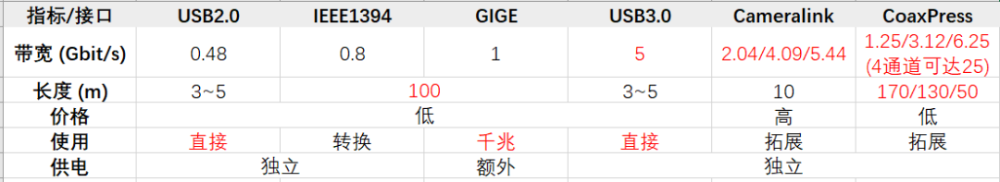

# 工业相机

## 1. 工业相机简介

* 基本工作原理:

    - 工业相机基本原理是将光信号转变成电信号,从而实现数字图像。

* 与一般相机的区别:

    -  配备专门软件开发工具包（Software Development Kit，SDK），我们可以通过代码设置包括：曝光时间、触发方式、图像分辨率、成像帧率等等一系列相机参数（下面是某款相机SDK的图像界面）。

   - 成像精准：一般来说，工业相机的图像传感器是逐行扫描的，而普通传感器是隔行扫描的，前者生产工艺更为复杂，成品率低、出货量少，世界上只有少数公司能够提供这类产品。此外，工业相机的畸变、色彩还原准确度往往更好，而单反相机追求的是要拍的好看。

   -  稳定性和可靠性：工业相机的性能稳定可靠、易于安装，结构紧凑结实不易损坏，连续工作时间长，可在较差的环境下工作，这是单反相机做不到的.

## 2. 工业相机的分类

## 2.1 线阵与面阵相机

### 2.1.1 面阵相机

   

* 像元深度：像元深度定义了灰度由暗道亮的灰阶数, 对于 8bit 的相机 0 代表全暗而 255 代表全亮。介于 0 和 255 之间的数字代表一定的亮度指标。10bit 数据就有 1024 个灰阶而 12bit 有 4096 个灰阶。从 8bit 上升到 10bit 或者 12bit 的确可以增强测量的精度，但是也同时降低了系统的速度.

* 机械快门：用弹簧或是电磁手段，控制几片叶片的开闭，或是两层帘幕像舞台“拉幕”一样左右或上下以一定宽度的缝隙“划过”成像像场窗口，让窗口获得指定时间长短的“见光机会”——这就使通常的机械快门概念。 
* 电子快门：通过电路直接操作 CCD／CMOS 控制快门曝光，被称为电子快门。利用了 CCD／CMOS 不通电不工作的原理，在 CCD 不通电的情况下，尽管窗口“大敞开”，但是并不能产生图像。如果在按下快门钮时，使用电子时间电路，使 CCD／CMOS 只通电“一个指定的时间长短”，就也能获得像有快门“瞬间打开”一样的效果。一般而言，机械快门的好处是不用电即可工作，缺点是高速和低速档比较会不准确。
* 工业相机与图像采集卡搭配原则：
    - 视频信号的匹配
    - 分辨率的匹配
    - 特殊功能的匹配
    - 接口的匹配
* 选型实例：
    - 产品尺寸检测，产品的大小为18mm*10mm,精度为0.01mm,流水检测速度为10件/秒，视野大小为20mm*12mm;

    - 选型分析:

    > 我们软件的测量精度可以考虑1/2亚像素精度，那么我们相机的分辨率为20/0.01/2=1000pixel，另外一个方向是12/0.01/2=600piel,因此相机可以选择1024*768，或者以上的相机，帧率在15帧/s以上即可。

### 2.1.2 线阵相机  

   * 特点

     * 线阵相机使用的线扫描传感器通常只有一行感光单元（少数彩色线阵使用三行感光单元的传感器）
     * 线阵相机每次只采集一行图像；
     * 线阵相机每次只输出一行图像；
     * 与传统的面阵相机相比，面阵扫描每次采集若干行的图像并以帧方式输出

* 采集速度：线阵相机通常用行频为单位 KHz, 如 12KHz 表示相机在 1 秒钟内最多能采集 12000 行图像数据
* 像元深度：像元深度定义了灰度由暗道亮的灰阶数, 对于 8bit 的相机 0 代表全暗而 255 代表全亮。介于 0 和 255 之间的数字代表一定的亮度指标。10bit 数据就有 1024 个灰阶而 12bit 有 4096 个灰阶。从 8bit 上升到 10bit 或者 12bit 的确可以增强测量的精度，但是也同时降低了系统的速度.

* 选型实例

    - 计算分辨率；幅宽除以最小检测精度得出每行需要的像素。
    - 检测精度；幅宽除以像素得出实际检测精度。
    - 扫描行数；每秒运动速度长度除以精度得出每秒扫描行数。
    - 根据以上计算结果选择线阵相机

   - 举例如下: 如幅宽为 1600 毫米, 精度 1 毫米, 运动速度22000mm/s 相机; 

        - 分辨率:1600/1＝1600 像素,加上宽放,所以最少 2000 像素;选定分辨率为2K;
        - 实际检测精度:1600/2000＝0.8 ;
        - 扫描行数(行频):22000mm/0.8mm＝27.5KHz 
        - 综合:应选定相机为 2048 像素 ,行频28kHz 相机；

### 2.1.3 面阵与线阵对比

* 面阵相机：实现的是像素矩阵拍摄。优点在于可以获取二维图像信息，测量图像直观适用多种场合, 缺点在于像元总数多，但每行的像元数一般较线阵少，帧幅率受到限制.
* 线阵相机：与面阵工业相机相比，它的传感器只有一行感光元素，因此使高扫描频率和高分辨率成为可能, 线阵工业相机非常适合测量一维动态物体，可以准确测量到微米。缺点在于要用线阵获取二维图像，必须配以扫描运动，而且为了能确定图像每一像素点在被测件上的对应位置，还必须配以光栅等器件以记录线阵每一扫描行的坐标。

### 2.2 CCD与CMOS

* CCD 与CMOS 图像传感器光电转换的原理相同，最主要的差别在于信号的读出过程不同. 从功耗角度而言, CMOS低于CCD, 从速度而言, CMOS也优于CCD, 但是由于CMOS的图像噪声较大, 图像质量较差.

## 2. 工业相机的接口

* 工业相机的接口主要有三种类型：

    > 1. 镜头接口：固定相机跟镜头，也称为卡口；
    > 2. 数据接口（控制）：传输拍摄到的相机数据（控制相机）；
    > 3. 电源接口（控制）：提供相机电源（控制相机）；
    > 4. 数据口和电源口也会放一起，接口既能提供数据传输又能提供相机电源

 * 镜头接口:

    >* 常见的工业相机镜头接口包括：C、CS、M42、M50、F、V、T2等等，接口类型的不同和工业相机镜头性能、质量并无直接关系，仅仅是接口方式不一样. 一般而言, 相机接口与相机镜头是对应的.
    >* 相机镜头的C、CS接口非常相似，它们的接口直径、螺纹间距都是一样的，仅仅是法兰距不同。C接口的法兰距是17.5mm，CS接口的法兰距是12.5mm。因此对于CS接口的相机，如果想要接入C接口的镜头，只需要一个5mm厚的CS-C转换环即可。而CS型镜头与C型摄像机无法配合使用。
    >* 法兰距：也叫做像场定位距离，是指机身上镜头卡口平面与机身曝光窗平面之间的距离，即镜头卡口到感光元件（一般是CMOS或CCD）之间的距离。注意，法兰距不同，即便装上也无法清晰对焦和成像

    

 * 数据/电源接口:

    

<!-- | 接口 | USB2.0 | USB3.0|IEEE1394 | GIGE|Cameralink| CoaxPress|
| :-----| ----: | :----: | :-----| ----: | :----: |:----: |:----: |
| 带宽(gbit/s) | 0.48 | 5 |0.8|1|2.04/4.09/5.44|1.25/3.12/6.25(4通道25)|
| 长度(m) | 3-5 | 3-5 |100|3-5|10|170/130/50|
| 价格 | 低| 低 |低|低|高|低|
| 使用 |直接 | 直接 |转接头|千兆|拓展|拓展|
| 供电 | 独立 | 独立 | 独立|额外|独立|独立| -->

* USB2.0、3.0系列：这类接口的好处是即插即用（虽然这里说是即插即用，但一般工业相机都还是要安装驱动以及相应的SDK才能调用的），3.0的速度达到了5.0GB，但问题是传输的线路太短，不太适合长距离、大批量工业相机的应用场景（这在大多数化工企业中是这样，相机安装在工厂的各个角落，处理放在主控室）。

* IEEE1394：Apple公司推出的标准，传输速度介于USB2.0~3.0之间（还是比较慢的），传输距离达到了100m，但是其需要额外的转接头，因此应用也不多。

* GIGE：也就是常说的网口相机，传输速度虽然不高（一般来说也够用了），但是传输距离远，集成方便，配合上千兆路由器，可以实现大规模的工业相机集成，目前工业应用上最为广泛，较为高端的工业相机也大多采用这种配置，唯一的缺点是需要额外的电源供电。

* Cameralink：一种专门的工业级视觉产品使用行业标准，传输速度可以达到5.44Gbit/s，往往用在之前的一些高速相机上(因为之前USB2.0、GIGE这些接口都太慢了)，但缺点是需要额外的图像采集卡、价格贵（一条线缆1000）、而且不好用，要自己去写相机驱动，并且不支持热插拔（会损坏相机！）。

    >原因：使用这类接口的相机在物理上被硬生生地拆为两部分，相机的厂商只负责相机的制造，而相应的驱动、软件，比如说图像的采集、处理等算法都需要你自己对CameraLink采集卡进行编程。

* CiaXPress：速度快、传输距离远，独立供电、价格也便宜，推出来用以取代Cameralink接口。这类相机需要额外的接口卡，注意，这里是接口卡！接口卡不同于采集卡，其只是相机采集到的数据的一个中转站，不会对数据做任何处理，其直接将数据存储在主寄存器中。

    >因为这类相机传输速度较快，如果将拷贝数据的工作交给CPU来做的话，CPU将会消耗大量资源.

## 3. 镜头参数

 * 焦距(f)，对于单片凸透镜来说，焦距通常指平行光线经凸透镜汇聚后一点到透镜中心的这段距离。通常，这个距离在制造完成后就不可变的，也就是说一块凸透镜的焦距是不会发生变化的。

 * 景深(Depth of view，EOF)：物体离最佳焦点较近或较远时，镜头保持所需分辨率的能力。焦点附近，也就是在景深范围内清晰，而前后方景物都比较模糊

 * 光圈(Aperture): 光圈大小是用 f 值来刻画的，意思是开了几分之几，影响镜头的进光量。光圈值为f/2.0，意思是开了1/2。
 

## 3.1 常见镜头标识

* 关于工业相机中常见的镜头标识大致如下：

## 4. 相机参数

*  分辨率（Resolution）：相机每次采集图像的像素点数（Pixels）。由工业相机所采用的芯片分辨率决定，是芯片靶面排列的像元数量。分辨率影响采集图像的质量，在对同样大的视场（景物范围）成像时，分辨率越高，对细节的展示越明显。

* 像元大小: 单个像素的物理尺寸大小，一般来说，像元尺寸越小，制造难度越大，图像质量也越不容易提高。目前工业数字相机像元尺寸一般为3~4 。

* 靶面尺寸: 图像传感器的感光部分的大小。 常见的靶面有1/4''、1/3''、1/2''、2/3''、1''等几种，当然也有其他规格。靶面尺寸规格见下表.

    > 像元大小和像元数（分辨率）两者共同决定相机靶面的大小，是此消彼长的关系，所以我们选择相机的时候也并不是分辨率越高越好，而是挑选合适的分辨率。

* 像素深度（Pixel Depth）：每位像素数据的位数，常见的是8bit，10bit，12bit。分辨率和像素深度共同决定了图像的大小。例如对于像素深度为8bit的500万像素，则整张图片应该有500万*8/1024/1024=37M

* 最大帧率（Frame Rate）/行频（Line Rate）：相机采集传输图像的速率，对于面阵相机一般为每秒采集的帧数（FPS），对于线阵相机机为每秒采集的行数（Hz).

* 曝光方式（Exposure）和快门速度（Shutter）: 线阵相机为逐行曝光的方式，可以选择固定行频和外触发同步的采集方式，曝光时间可以与行周期一致，也可以设定一个固定的时间；面阵相机有帧曝光、场曝光和滚动行曝光等几种常见方式，工业数字相机一般都提供外触发采图的功能。快门速度一般可到10微秒，高速相机还可以更快.

* 曝光时间: 也称为快门速度，指从快门打开到关闭的时间间隔，在这一段时间内，物体可以在底片上留下影像。

* 光谱响应特性: 指传感器对不同光波的敏感特性，一般来说，响应范围都在350nm~1000nm间。有的相机在靶面前面会增加一个滤镜，滤除红外线，如果系统需要多红外光感应，可以去除该滤镜。

* 信噪比: 相机的信噪比定义为图像中信号与噪声的比值，代表了图像的质量，图像信噪比越高，相机性能和图像质量越好

## 5. 工业光源分类

* 背光源：提供最佳对比度；丢失的光源非常少
* 同轴光
* 非同轴漫射光
* 偏振光：用于减少眩光或是镜面反射
* 红外光
* 紫外光：很多物体在紫外光的照射下会发出荧光
* 彩色原理
* 色环原理

## 6. 相机和镜头选取

* 相关参数
    - 视场(Field of view, FOV) ：指观测物体的可视范围，也就是充满相机采集芯片的物体部分。

        - 视场（FOV）=工作距离（WD）*CCD靶面型号尺寸（V或者H）/焦距（f）
        - 在物距有限时候,视野可以通过下式计算
            >- $Y=Y'*\frac{L}{f}$
            >- Y: 物体尺寸 Y':图像尺寸 L:物距 f:焦距
    - 工作距离(Working Distance, WD) ：指从镜头前部到受检验物体的距离。即清晰成像的表面距离。
    - 分辨率：图像系统可以测到的受检验物体上的最小可分辨特征尺寸。在多数情况下，视野越小，分辨率越好。
    - 景深 (Depth of view，即DOF)：物体离最佳焦点较近或较远时，镜头保持所需分辨率的能力;
        - 景深具有如下性质:
          > 光阑指数F越大,景深越大
          > 焦距越短,景深越大
          > 景物越远,景深越大
          > 后景深大于前景深
        - 景深可以通过下式计算
          > 前景深 $Tr=\frac{\delta*F*L^2}{f^2-\delta*F*L}$
          > 后景深 $Tf=\frac{\delta*F*L^2}{f^2+\delta*F*L}$
          > 景深 $=Tr+Tf$
          > 焦深 $=2\delta*F$
          > f:焦距  
          > $\delta: 容许模糊圈$
          > L:物距 
          > F:光阑指数
    - 视场角（Angle of View, FOV）：影响理论视场范围.
        > $\theta=2tan^{-1}\frac{Y'}{2f}$
        > $\theta$: 视角  Y': 图像尺寸 f:焦距
    - 光学倍率 = 靶面尺寸（H or V）/FOV（H or V）
    - 光学放大率 = CCD相机尺寸/现场实际尺寸
    - 显示器放大率 = 光学放大率 * 电子放大率
* 镜头：

    - 镜头接口: 跟相机接口匹配，也可以外加转换口后匹配，并且镜头可支持的最大CCD尺寸应大于选配相机CCD尺寸大小。
    - 镜头焦距

        - 焦距（f）=工作距离（WD）*CCD靶面型号尺寸（V或者H）/视场大小或者物体高度（FOV）
        - 焦距大小的影响情况：焦距越小，景深越大； 焦距越小，畸变越大； 焦距越小，渐晕现象越严重，使像差边缘的照度降低；
        - 在物距有限时候,视野可以通过下式计算
            >- $f=Y'*\frac{L}{Y}$
            >- Y: 物体尺寸 Y':图像尺寸 L:物距 f:焦距

            

    - 失真（distortion）：（衡量镜头性能的指标之一）：又称畸变，指被摄物平面内的主轴外直线，经光学系统成像后变为曲线，则此光学系统的成像误差称为畸变。畸变像差只影响影像的几何形状，而不影响影像的清晰度。
    - 光圈与F值：光圈是一个用来控制镜头通光量装置，它通常是在镜头内。表达光圈大小我们是用F值，如f1.4，f2，f2.8;
    - 光学放大倍数：PMAG=感光芯片尺寸（mm）/视场（mm）

    

* 镜头选型案列：
    - 已知条件:工业相机型号已经选择好,具体参数:工业相机芯片尺寸为2/3",C接口，5百万像素;视野是100*100mm, 工作距离:500mm; 

    - 根据以上条件,我们来选择合适的工业镜头;

        > 镜头接口: 首先工业镜头要和工业相机接口一致, 所以这里也选择C接口; 
        > 镜头大小: 遵循镜头大小要大于相机的芯片大小, 所以这里镜头尺寸最少支持2/3"; 
        > 镜头分辨率:  	镜头的分辨率要高于相机的分辨率, 所以选择5百万像素以上; 
        > 焦距: 500(工作距离)× 8.8(芯片水平长度)/ 100(视野)=44mm; 
        > 镜头放大倍率:	8.8(芯片水平长度)/ 100=0.088

    

    - 镜头光圈范围:

        >- 光圈大小决定图像亮度，在拍摄高速运动物体、曝光时间很短的应用中，应选用大光圈镜头以提高图像亮度。
