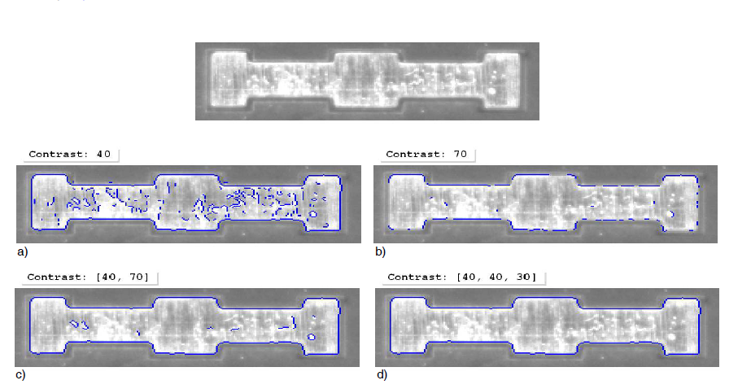

# 模板匹配

## 1.1 什么是模板匹配

* 模板匹配的主要思想是使用原型对象（模板），为其创建模型，然后在其他图像中搜索该模型。对于大多数匹配任务，可以从显示感兴趣对象(ROI)的参考图像中获取模型.
* HALCON提供的不同匹配方法在用于构建模型的图像结构中彼此不同。 一些匹配方法使用例如灰度值与其周围环境（邻域）的关系来建立模型。 还有的则使用例如轮廓形状（见图1.1）。 匹配的结果分别是关于位置的信息，在大多数情况下接近方向，在某些情况下也能找到搜索图像中对象的比例。

    
    >图1.1：使用轮廓形状进行匹配：
    >a）注意标志的图像用于构建
    >b）具有不同分辨率（金字塔等级）的（形状）模型，用于在
    >c）在图像中找到模型的实例。

## 1.2 模板匹配的分类

* 1. 一种通过包含的像素的灰值关系来描述模型的方法。

  > - 基于互关联的匹配（第47页的第3.1节），它使用归一化互相关
（NCC）分别匹配对象或图案。

* 2. 通过轮廓形状描述模型的方法。

  > -  基于形状的匹配
  > - 基于组件的匹配，它是针对对象的多个组件（刚性部分）相对移动的特定情况而设计的
  > - 局部可变形匹配，该匹配可处理并返回对象的局部变形，并允许校正包含变形模型的图像部分
  > - 透视变形匹配，它也可以处理透视变形，并提供校准版本，通过该版本还可以导出3D姿态而不是2D变换参数

* 3. 一种通过一组重要图像点来描述模型的方法。

  > - 基于描述符的匹配, 匹配一组所谓的兴趣点，类似于透视图可变形匹配，它可以处理透视图变形。    

## 2.1 各种匹配适合的情况

### 2.1.1 基于组件匹配与局部可变形匹配
* 仅当感兴趣的对象由彼此相对移动的不同组件组成时，并且不希望在搜索图像中缩放对象时，才应用基于组件的匹配。
   
  - 图1.6：由两个相对运动的组件组成的对象。
* 仅当目标物体发生局部变形（例如由于曲面扭曲）时才应用局部可变形匹配。 与其他2D方法相比，它只返回找到的模型实例的位置，而不返回方向。 作为交换，它允许校正包含变形对象的图像部分，并返回描述实际变形的矢量场。
   
  -图1.7：具有局部变形的对象。
### 2.1.2 基于形状与基于相关性的匹配
- 基于相关的匹配适用于具有随机变化的纹理的对象或具有稍微变化的形状的对象,在处理强烈散焦的图像时，基于相关性的匹配将是首选.

- 如果无法避免遮挡或对象具有颜色变化或是需要进行平移和旋转，则应选择基于形状的匹配.

- 图1.8：可以通过基于形状的匹配来处理遮挡物。

## 3.1 互相关(Correlation-Based)匹配

* 互相关匹配(Correlation-Based)是基于灰度值。 该方法使用归一化互相关来评估模型与搜索图像之间的对应关系。 这一算法执行速度快并且可以补偿照度的相加和相乘变化。与基于形状的匹配相比，形状略有变化，纹理很多的对象或模糊的对象也可以找到图像（例如，由于散焦，轮廓在模糊的图像中消失), 而这些情况是形状匹配做不到的。

### 3.1.1 代码示例

* 以下程序演示了针对纹理和散焦的基于相关性匹配的鲁棒性。

  + 步骤1：在参考图片中选择对象

    > - 首先，在训练图像内使用gen_rectangle1创建一个包含对象的区域。 使用area_center查询该区域的中心。 在以后的步骤中将需要将匹配结果与原始区域重叠。 然后，将图像缩小到关注区域。

    

* 步骤1：在参考图片中选择对象

  + 

    - 图3.1 ：（左）参考图像，带有用于创建模型的ROI； （右）匹配模型的散焦实例。 

    >-图1.1：使用轮廓形状进行匹配：
    >a）注意标志的图像用于构建
    >b）具有不同分辨率（金字塔等级）的（形状）模型，用于在
    >c）在图像中找到模型的实例。

    

    ``` 
    read_image (Image, 'smd/smd_on_chip_05')
    gen_rectangle1 (Rectangle, 175, 156, 440, 460)
    area_center (Rectangle, Area, RowRef, ColumnRef)
    reduce_domain (Image, Rectangle, ImageReduced)
    ```

* 步骤2：建立模型

  > - 缩小的图像用于使用create_ncc_model创建NCC模型。 结果，操作员返回新创建的模型（ModelID）的句柄，然后该句柄可用于指定模型，例如，在对操作员find_ncc_model或find_ncc_models的调用中。
  

    >图1.1：使用轮廓形状进行匹配：
    >a）注意标志的图像用于构建
    >b）具有不同分辨率（金字塔等级）的（形状）模型，用于在
    >c）在图像中找到模型的实例。

    ``` 
    create_ncc_model (ImageReduced, 'auto', 0, 0, 'auto', 'use_polarity', ModelID)
    ```

* 步骤3：再次找到对象

  > - 现在，循环搜索搜索图像，对于每个搜索图像，使用第29页的第2.4.2.1节中所述的仿射变换来搜索NCC模型并将其覆盖在模型的区域中。请注意，在 聚焦图像，然后将搜索应用于具有不同散焦的图像。 尽管如此，所有对象实例都已找到。 图3.1显示了参考图像和散焦但找到的模型实例之一。

    >图1.1：使用轮廓形状进行匹配：
    >a）注意标志的图像用于构建
    >b）具有不同分辨率（金字塔等级）的（形状）模型，用于在
    >c）在图像中找到模型的实例。

    ``` 
    for J := 1 to 11 by 1
    read_image (Image, 'smd/smd_on_chip_' + J$'02')
    find_ncc_model (Image, ModelID, 0, 0, 0.5, 1, 0.5, 'true', 0, Row, Column, Angle, Score)
    dev_display (Image)
    dev_display_ncc_matching_results (ModelID, 'green', Row, Column, Angle, 0)
    endfor
    ```

### 3.1.2选择模型ROI

* 作为基于相关性匹配的第一步，必须按照第17页的2.1.1节中所述选择指定模板图像的感兴趣区域。该区域可以具有任意形状，即，也可以包含孔或由未连接的几个部分组成。
* 请注意，可以使用子采样来加快以后的搜索速度。为此，ROI不应太“薄”，因为否则它会在较高的金字塔层次上消失！根据经验，如果ROI的宽度为$2^{NumLevels-1}$像素，则您会处于安全状态。也就是说，8像素的宽度允许使用4个金字塔等级。

### 3.1.3创建合适的NCC模型

可以使用运算符create_ncc_model创建NCC模型。

  ``` 
  create_ncc_model(Template : : NumLevels, AngleStart, AngleExtent, AngleStep,Metric : ModelID)
  ```

* 通过调整参数NumLevels来使用子采样来加快搜索速度.
* 通过调整参数AngleExtent，AngleStart和AngleStep和指定在以后的搜索中将哪些像素与模型进行比较，即通过调整参数Metric来指定对象的极性.
* 对于参数NumLevels和AngleStep，可以让HALCON自动建议值。可以通过将create_ncc_model中的参数设置为值“auto”来完成；然后，如果您需要知道这些值，可以使用get_ncc_model_params查询它们。或者，在创建模型之前应用确定的_ncc_model_params。然后，您可以估算自动确定的值作为建议，因此您仍然可以为实际创建模型修改它们。请注意，两种方法仅返回大致相同的值，并且create_ncc_model返回的值更精确。

* 通过调整参数Metric可指定是否遵守极性，即对比度的“方向”。如果选择“use_polarity”值，则会观察到极性，即，搜索图像中的点必须显示与模型中相应点相同的对比度方向。例如，如果模型是深色背景上的明亮对象，则仅当该对象也比背景明亮时，才能在搜索图像中找到该对象。您可以选择值“ ignore_global_polarity”来选择全局忽略极性。但是，这种灵活性是以稍微降低识别速度和降低鲁棒性为代价的。

### 3.1.4 优化搜索过程

实际匹配是由运算符find_ncc_model或find_ncc_models执行的。

``` 
find_ncc_model(Image : : ModelID, AngleStart, AngleExtent, MinScore, NumMatches,MaxOverlap, SubPixel, NumLevels : Row, Column, Angle, Score)

```

* 通过参数AngleStart和AngleExtent来限制方向范围，从而限制搜索空间；
* 将搜索空间限制为与对象模型之间有一定程度的偏差，即通过参数MinScore（第3.1.4.3节）指定对象的相似性，
* 通过调整参数NumMatches选择返回的最大匹配数
* 通过调整参数MaxOverlap指定实例可以重叠的程度
* 通过调整参数SubPixel（第3.1.4.6节）来指定结果所需的精度，并且
* 限制搜索过程的金字塔级别（NumLevels）的数量, 通过将值0用于NumLevels，使用在创建模型时指定的值。

## 3.2 基于形状的匹配

* 基于形状的匹配不使用像素及其邻域的灰度值作为模板，而是通过轮廓的形状描述模型。 还可以通过有关相邻边缘的其他约束来扩展模型。

### 3.2.1 示例

在本节中，我们将对基于形状的匹配过程进行快速概述。 

* 步骤1：在参考图片中选择对象

抓取参考图像后，第一个任务是创建一个包含对象的区域。 在示例程序中，使用算子gen_rectangle1创建一个矩形区域。 或者，您可以使用例如draw_rectangle1交互式绘制区域，也可以使用先前的细分过程产生的区域。 然后，使用算子reduce_domain创建仅包含所选区域的图像，即模板图像，结果如图3.2所示。

``` 
Row1 :=188
Column1 := 182
Row2 :=298
Column2 := 412
gen_rectangle1 (ROI, Row1, Column1, Row2, Column2)
reduce_domain (ModelImage, ROI, ImageROI)
```

* 第二步：创建模型

使用算子create_shape_model创建模型。 在此之前，我们建议应用算子inspect_shape_model，它可以帮助您找到合适的参数来创建模型。

``` 

inspect_shape_model，它可以帮助你找到合适的参数来创建模型。
inspect_shape_model (ImageROI, ShapeModelImages, ShapeModelRegions, 8, 30)
create_shape_model (ImageROI, NumLevels, 0, rad(360), 'auto', 'none', 'use_polarity', 30, 10, ModelID)
```

inspect_shape_model显示两个参数的影响，特别是在其上创建模型的金字塔级别的数量（NumLevels）和必须在模型中包括对象点的最小对比度（Contrast）。结果，算子inspect_shape_model返回所选金字塔等级上的模型点，如图3.2所示。因此，您可以检查该模型包含描述感兴趣对象的相关信息。

如果不仅允许方向变化，而且允许搜索对象的比例发生变化，则必须使用算子create_scaled_shape_model或create_aniso_shape_model创建模型。然后，您可以使用与用于角度范围的参数相似的参数来描述允许的比例范围。

* 第三步：再找对象

要在搜索图像中找到对象，您需要做的就是调用算子find_shape_model。 图3.3显示了其中一个示例图像的结果。

``` 

for i := 1 to 20 by 1
grab_image (SearchImage, FGHandle)
find_shape_model (SearchImage, ModelID, 0, rad(360), 0.7, 1, 0.5,'least_squares', 0, 0.7, RowCheck, ColumnCheck, AngleCheck, Score)
endfor
```

### 3.2.2 选择ROI模型

作为基于形状的匹配的第一步, ROI区域可以具有任意形状，即，也可以包含孔或由未连接的几个部分组成。在参考图像中存在杂波的情况下使用基于形状的匹配时，还可以使用算子inspect_shape_model通过其他图像处理来改善交互式选择的ROI。

### 3.2.3 创建一个合适的形状模型

从参考图像导出模板图像之后，可以创建形状模型。 请注意，基于形状的匹配包括在图像中找到训练对象的不同方法。 根据所选方法，使用以下算子之一创建模型：

* create_shape_model 创建一个简单的基于形状的匹配模型，使用模板图像进行匹配得出模型，并且支持不缩放。

* create_shape_model_xld为基于形状的简单匹配创建模型，该匹配使用XLD轮廓导出模型并且不支持缩放。

* create_scaled_shape_model为基于形状的匹配创建模型，该模型使用模板图像导出模型并支持统一缩放。
* create_scaled_shape_model_xld为基于形状的匹配创建模型，该模型使用XLD轮廓导出模型并支持统一缩放。
* create_aniso_shape_model为基于形状的匹配创建模型，该模型使用模板图像导出模型并支持各向异性缩放。
* create_aniso_shape_model_xld为基于形状的匹配创建模型，该模型使用XLD轮廓导出模型并支持各向异性缩放。

``` 

create_scaled_shape_model(Template : : NumLevels, AngleStart, AngleExtent, AngleStep, ScaleMin, ScaleMax, ScaleStep, Optimization, Metric, Contrast, MinContrast : ModelID)

```

正如名称“基于形状的匹配”所暗示的那样，对象由其形状表示和识别。存在多种确定或描述对象形状的方法。在这里，形状通过选择相邻对比度超过某个阈值的所有那些点来提取。通常，这些点是对象轮廓的一部分。

* 通过调整参数Contrast来调节对比度.
* 通过调整参数AngleExtent，AngleStart和AngleStep可以控制对象的旋转范围, 起始弧度, 以及步长.
* 通过调整参数ScaleMin，ScaleMax和ScaleStep或各向异性缩放的相应参数，允许特定范围的缩放。
* 通过调整参数MinContrast和Metric，指定在以后的搜索中将哪些像素与模型进行比较。

    >- 使用参数MinContrast，您可以指定搜索图像中的点至少必须具有哪种对比度才能与模型进行比较。此参数的主要用途是从匹配过程中排除噪声，即灰度值波动。您可以通过为MinContrast指定值“自动”，让HALCON自己选择合适的值.

#### 3.2.3.1指定属于模型的像素（Contrast）

对于模型而言，在调用create_shape_model或其等效项之一时, 对比度超过参数Contrast指定的阈值时（即与相邻像素的灰度值之差）的像素会被选择。 为了获得合适的模型，对比度的选择应该以包括那些重要的像素. 显然，模型不应该包含杂波，即不属于对象的结构。
在某些情况下，不可能找到一个唯一的对比度阈值来既能消除混乱，且没有消除对象的有效地部分。 图3.5显示了一个示例。 任务是为垫的轮廓创建模型。 如果选择了完整的轮廓，则模型还将包含杂波（图3.5a）。 如果去除杂波，轮廓的一部分将丢失（图3.5b）。



图3.5：通过对比度选择重要的像素：a）完整的物体，包含杂乱；b）杂乱少，但不完整。
对象；c) 滞后阈值；d) 最小轮廓尺寸。

为解决此问题，参数“对比度”提供了两种附加方法：滞后阈值和根据轮廓尺寸选择轮廓部件。通过为“对比度”指定值的元组而不是单个值来使用这两种方法。

滞后阈值（另请参阅算子hysteresis_threshold）使用两个阈值，一个较低的阈值和一个较高的阈值。对于该模型，选择对比度高于上限阈值的第一像素。然后，添加对比度高于下阈值的像素，并且直接或通过对比度高于下阈值的另一个像素与高对比度像素相连的像素。此方法可以选择轮廓
局部对比度低的部分。。此方法使您可以选择对比度局部较低的轮廓零件。返回带有垫的示例：如图3.5c所示，具有滞后阈值，您可以为垫的完整轮廓创建模型，而不会造成混乱。以下代码行显示如何在元组中指定两个阈值：
第二种去除杂乱的方法是为轮廓组件指定一个最小尺寸，即像素数。图3.5d显示了示例任务的结果。最小尺寸必须在第三个元素中指定。的元组。如果你不想额外使用滞后阈值，你必须将前两个元素设置为价值相同。
也可以通过为Contrast指定值“ auto”，让HALCON自己选择合适的值。

#### 3.2.3.4 允许比例范围(ScaleMin, ScaleMax, ScaleStep)

与方向范围类似，您可以指定允许的比例范围。 您可以采用两种形式进行缩放：

1. 行和列方向的缩放比例相同（缩放比例均匀）
2. 行和列方向的缩放比例不同（各向异性缩放比例）

要进行均匀缩放，使用算子create_scaled_shape_model的ScaleMin，ScaleMax和ScaleStep参数指定缩放范围。对于各向异性缩放，请改用算子create_aniso_shape_model，它具有六个缩放参数，而不是上面的三个。

### 3.2.4 优化搜索过程   

实际匹配由以下算子之一执行：

* find_shape_model搜索单个模型的实例，如果模型的实例的比例可能不变化，则使用find_shape_model，
* find_shape_models同时搜索多个模型的实例，如果模型的实例的比例可能不变化，则使用find_shape_models，
* find_scaled_shape_model搜索单个模型的实例，如果允许统一缩放，则使用find_scaled_shape_model，
* find_scaled_shape_models同时搜索多个模型的实例，并在允许统一缩放的情况下使用，
* find_aniso_shape_model搜索单个模型的实例，如果允许在行和列方向上使用不同的缩放因子，则使用find_aniso_shape_model
* find_aniso_shape_models同时搜索多个模型的实例，如果允许在行和列方向上使用不同的比例因子，则将使用它们。

``` 

find_scaled_shape_model(Image : : ModelID, AngleStart, AngleExtent, ScaleMin, ScaleMax, MinScore, NumMatches, MaxOverlap, SubPixel, NumLevels, Greediness : Row, Column, Angle, Scale, Score)
```

* 通过参数AngleStart，AngleExtent，ScaleMin和ScaleMax或各向异性缩放的相应参数来限制方向和缩放范围，从而限制搜索空间（第64页的3.2.4.2节），
* 将搜索空间限制为对象允许的特定遮挡量，即，通过参数MinScore（第64页的3.2.4.3节）指定对象的可见性，
* 将搜索限制在相对于模型轮廓指定的区域内没有（或太微弱）混乱边缘的候选对象（第65页的3.2.4.4节），
* 通过调整参数贪婪度（第65页第3.2.4.5节），指定使用的搜索试探法，即交易彻底性与速度。
* 通过调整参数SubPixel（第68页的3.2.4.8节）来指定结果所需的精度
* 限制搜索过程的金字塔级别数（NumLevels）（第69页的3.2.4.9节）

请注意，许多匹配方法只能用于搜索图像中单个模型的单个实例，而基于形状的匹配还可以用于同时搜索多个模型的多个实例。

####  3.2.4.2限制方向和比例的范围（AngleStart，AngleExtent，ScaleMin，ScaleMax）

创建模型时，您已经指定了方向和比例的允许范围。调用算子find_shape_model或其等效项之一时
您可以使用参数AngleStart，AngleExtent，ScaleMin和ScaleMax（或各向异性缩放的相应缩放参数）进一步限制这些范围。如果您可以通过其他信息（例如，可以通过适当的图像处理操作获得这些信息）来限制这些范围，则此功能很有用。
创建模型时使用更大范围的另一个原因可能是您还希望将模型重用于其他匹配任务。
请注意，如果用于创建模型的比例范围大于用于搜索的范围，则即使在稍微受限的比例范围之外，也可能会在搜索图像中找到该模型。

#### 3.2.4.4使用Clutter参数限制搜索

在某些情况下，尽管在搜索图像中找到了多个具有较高“得分”值的匹配项，但并非所有人都希望将其作为结果。例如，在图3.12中，尽管仅搜索由八个点组成的结构，但发现了更多实例。为了仅获得所需的匹配，必须区分实例。可以考虑将对象附近没有边缘作为独特特征来完成此操作。


#### 3.2.4.5交易彻底性与速度（Greediness）

使用参数Greediness，您可以影响搜索算法本身，从而以速度为代价交换完整性。如果选择值0，则搜索是彻底的，即，如果存在对象（并且在允许的搜索空间内并且达到最低分数），则会找到该对象。但是，在这种模式下，即使是非常不可能的匹配候选者也会被彻底检查，从而大大减慢了匹配过程。
参数Greediness和MinScore会相互影响，即，您可能必须指定较低的MinScore才能使用greedier搜索。通常，您可以以较高的贪婪度和足够低的最低分数来达到较高的速度。
